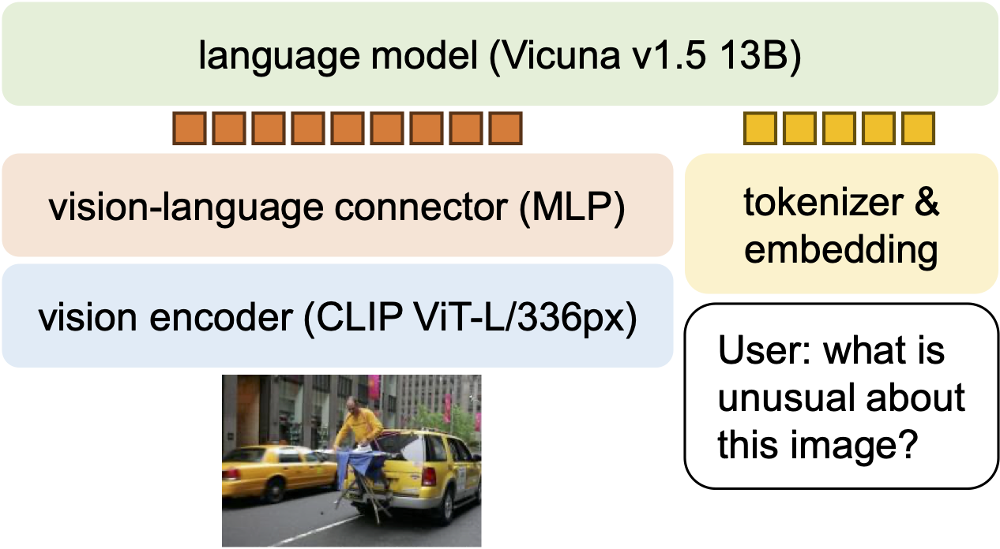
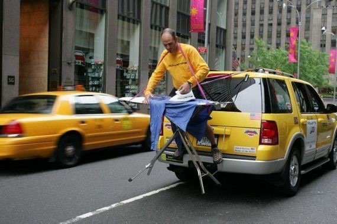
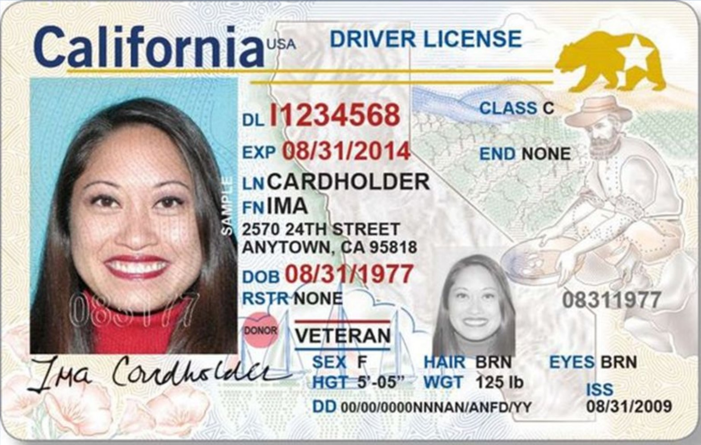

# LLaVA-1.5 论文精读报告

论文题目：**Improved Baselines with Visual Instruction Tuning**

论文版本：`arXiv:2310.03744v2`，页面首页显示日期为 `2024-05-15`

阅读对象：LLaVA-1.5 论文与附录，重点关注其**相对原始 LLaVA 的改进、方法原理、数据流转、数据处理、数据格式、训练流程与局限性**

说明：本报告以三类信息为基础组织内容。

- **论文明确说明**：来自论文正文、附录、图表。
- **官方实现/README 补充**：来自官方 `LLaVA` 仓库公开脚本与文档，用来帮助解释训练接口和数据格式。
- **合理推断**：论文没有逐字段写出的实现细节，我会明确标注，不把推断写成事实。

## 1. 一页结论

如果只保留一句话，我会这样概括这篇论文：**LLaVA-1.5 的关键价值，不是发明了一个全新的多模态结构，而是在 LLaVA 框架内用非常“小而有效”的改动，把“自然视觉对话”和“学术型 VQA/OCR/区域理解”更好地统一起来。**

论文最核心的结论有五点：

- 原始 LLaVA 的全连接视觉-语言连接器并不弱，问题主要不在“必须换成复杂 resampler 才能强”，而在**数据和训练配方**。
- 相比原始 LLaVA，LLaVA-1.5 的关键增强包括：`CLIP-ViT-L-336px`、`2-layer MLP projector`、学术任务导向数据混合、`response formatting prompts`。
- 这些改动叠加后，模型在 `VQAv2 / GQA / TextVQA / MME / MMBench / MM-Vet` 等多个 benchmark 上都有明显提升。
- 论文还进一步探索了 `LLaVA-1.5-HD`：通过**切网格编码 + 全局低分辨率上下文**来支持更高输入分辨率，并报告了更好的细节感知和更低幻觉。
- 它的重要“创新性”更接近**系统化 recipe innovation**，而不是单点结构发明：即在公开数据、有限算力、简单结构下，给出一套高可复现、强性能的训练方案。

从“和原始 LLaVA 比较”的角度看，LLaVA-1.5 最重要的不是把模型复杂化，而是把下列几个问题处理得更干净：

- 原始 LLaVA 偏向长回答和自然聊天，对短答案、选项题、OCR 型任务不够友好。
- 原始 LLaVA 没有系统处理“回答格式控制”，因此容易在需要单词、短语、选项字母时输出冗长自然语言。
- 原始 LLaVA 的训练数据侧重 `LLaVA-Instruct-158K`，而 1.5 显式引入了 VQA/OCR/区域级数据和 ShareGPT 文本对话。
- 原始 LLaVA 的视觉输入分辨率更低，而 1.5 与 1.5-HD 明确把“看清细节”作为可扩展方向。

## 2. 论文定位与整体图景

论文标题中的 `Improved Baselines` 非常关键。作者并没有把这篇工作包装成“彻底替代旧范式的新框架”，而是明确地把它定义为：**在 LLaVA 框架内做受控实验，系统研究 LMM 设计选择，并建立更强、更可复现的 baseline。**



从 Figure 1 可以直接读出作者想强调的三件事：

- 它在 11 个任务上达到或接近当时 SoTA。
- 它的训练样本规模比一些强基线小很多。
- 它的结构变化其实很有限，主要是 `MLP connector + academic-task-oriented data + response formatting`。

因此，这篇论文真正回答的问题可以写成：

- **问题 1**：原始 LLaVA 为什么擅长自然视觉对话，却不擅长很多 academic benchmarks？
- **问题 2**：是不是必须引入更复杂的 `Q-Former / resampler / 大规模额外预训练` 才能提升？
- **问题 3**：如果不大改架构，只改数据、输出提示和少量连接层，能不能得到更强、更通用的多模态助手？

作者的回答总体是肯定的。

## 3. 相比原始 LLaVA，LLaVA-1.5 到底改了什么

为了避免把改动说散，先给一个压缩版对比。

- **视觉编码器**
  原始 LLaVA：核心版本通常围绕 `CLIP ViT-L/14`。
  LLaVA-1.5：换成 `openai/clip-vit-large-patch14-336`，把输入从更低分辨率提升到 `336 x 336`。

- **视觉到语言的连接器**
  原始 LLaVA：单层线性投影。
  LLaVA-1.5：`mlp2x_gelu`，也就是两层 MLP，中间带 `GELU`。

- **指令微调数据**
  原始 LLaVA：核心是 `LLaVA-Instruct-158K`。
  LLaVA-1.5：扩展成 `665K` 的多源混合数据，加入 `VQAv2 / GQA / OKVQA / A-OKVQA / OCRVQA / TextCaps / RefCOCO / Visual Genome / ShareGPT`。

- **回答形式控制**
  原始 LLaVA：没有系统化的“短答案格式提示”机制。
  LLaVA-1.5：为不同数据集和评测集加入明确的 `response formatting prompt`。

- **输入分辨率扩展**
  原始 LLaVA：没有本文这种系统化的高分辨率扩展分析。
  LLaVA-1.5-HD：用“切网格编码 + 合并 + 全局上下文”的方式支持更高分辨率输入。

- **能力侧重点**
  原始 LLaVA：更像一个会聊天、会描述图像的视觉助手。
  LLaVA-1.5：在尽量保留视觉聊天能力的同时，显著补齐学术型 VQA、OCR、多选题、区域理解。

我认为这篇论文最值得注意的一点是：**这些改动不是彼此孤立的。**

- `VQA` 数据本身能提升短答案任务。
- 但如果不加 `format prompt`，模型容易学偏输出风格。
- 只改数据还不够，`MLP projector` 进一步提升跨模态表示能力。
- 当模型要看 OCR 或细粒度区域时，`336` 分辨率和后续 `HD` 扩展就变得重要。
- `ShareGPT` 文本对话则帮助模型保留更好的自然语言行为、多语种适应能力和写作能力。

## 4. 论文认为原始 LLaVA 的主要短板是什么

作者在第 3 节对比了 LLaVA 与 InstructBLIP。这个对比的重点不是“谁绝对更好”，而是二者代表了两种不同偏向：

- 原始 `LLaVA` 更强于真实视觉对话与长回答风格。
- `InstructBLIP` 更强于很多学术型 VQA benchmark，但可能在自然对话上过拟合短答案。

论文认为，原始 LLaVA 的核心短板是：

- 它对很多 academic benchmark 所要求的**短格式答案**适配不足。
- 对 `yes/no` 类型问题，容易出现回答分布偏置。
- 训练分布里缺少足够多的 `OCR / multiple-choice / short-answer / region-level` 数据。


这张图很重要。作者并不是简单地说“加 VQA 数据就会更强”，而是指出了一个更细的根因：

- 如果训练提示只是模糊地写成 `Q: ... A: ...`，模型并不知道你到底想要一句自然回答，还是一个单词、短语、选项字母。
- 一旦训练中短答案样本变多，但提示不清晰，模型就可能把“短答倾向”扩散到不该短答的场景。
- 所以，问题不只是“训练什么数据”，还包括“怎样把期望输出格式显式写进 prompt”。

这就是 `response format prompting` 的出发点。

## 5. 方法总览：LLaVA-1.5 的核心思路

LLaVA-1.5 的方法可以压缩成一句话：

**保留 LLaVA 的简单主干，把视觉 token 更稳地映射到 LLM 空间，再用更合理的数据混合和格式提示，让模型同时学会自然对话、短答案 VQA、OCR、多选题和区域理解。**

从设计维度看，它主要沿着三条线改进：

- **模型线**：线性 projector 改成 `2-layer MLP`。
- **输入线**：视觉编码器升到 `CLIP-ViT-L-336px`，后续再扩展到 `HD`。
- **数据线**：从 `LLaVA-Instruct-158K` 扩展到 `665K` 指令混合数据，并为不同任务加入显式格式提示。

{{LLAVA15_PIPELINE_DIAGRAM}}

### 5.1 模型架构图：按真实实现展开数据流

上面这张图更偏“训练阶段和数据来源”。如果要看单条样本在模型内部到底怎么流转，更合适的是下面这张架构图：

{{LLAVA15_ARCHITECTURE_DIAGRAM}}

这张图有三个阅读重点：

- 左侧的 `Raw Sample` 不是张量，而是磁盘路径和 `conversation JSON`。
- 中间分成文本支路和图像支路，二者直到 `prepare_inputs_labels_for_multimodal()` 才真正汇合。
- 右侧的 loss 不是对整条序列所有 token 统一计算，而是只对 assistant 输出位置计算；`system / user / image tokens` 会被设成 `IGNORE_INDEX=-100`。

这也是为什么只看 `tokenizer` 层会误以为“图像只占一个 token”，而真正进入 LLM 时，那个单独的 `<image>` 占位已经被整段视觉 embedding 替换掉了。

### 5.2 类 PyTorch `summary`：基础版 `LLaVA-1.5-13B`

下面这段不是运行 `torchinfo` 直接导出的日志，而是根据官方实现整理的“结构摘要版 summary”。它更适合用来理解模块边界和张量形状。

```text
Model Summary (LLaVA-1.5-13B, base 336, single image, one <image> placeholder)
================================================================================
Input Sample
  image_path / conversations                  Python dict / list[dict]

Text Branch
  preprocess_multimodal                       normalize <image> position
  conversation template                       list[dict] -> prompt string
  tokenizer_image_token                       prompt -> input_ids [1, T]

Image Branch
  CLIPImageProcessor                          PIL -> pixel_values [1, 3, 336, 336]
  CLIPVisionTower(select_layer=-2, patch)     [1, 3, 336, 336] -> [1, 576, 1024]
  mm_projector = Linear(1024,5120)
               -> GELU
               -> Linear(5120,5120)           [1, 576, 1024] -> [1, 576, 5120]

Fusion
  embed_tokens                                [1, T] -> [1, T, 5120]
  prepare_inputs_labels_for_multimodal        replace 1 IMAGE_TOKEN_INDEX with
                                              576 visual embeddings
                                              [1, T, 5120] -> [1, S, 5120]
                                              S = T - 1 + 576

Decoder / Prediction
  Vicuna / LLaMA decoder blocks x40           [1, S, 5120] -> [1, S, 5120]
  lm_head                                     [1, S, 5120] -> [1, S, vocab_size]

Supervision
  labels                                      [1, S]
  system / user / image tokens                -100 (IGNORE_INDEX)
  assistant response tokens                   keep target ids
  causal LM loss                              scalar
================================================================================
7B variant note:
  hidden size changes from 5120 to 4096; decoder depth changes from x40 to x32.
```

这个 summary 最关键的不是记住每一个数字，而是记住三条关系：

- 视觉塔输出维度是 `1024`，先在 projector 里变成和 LLM 一样的 hidden size。
- 文本里的 `<image>` 在 tokenizer 阶段只占 `1` 个逻辑占位，但在融合阶段会被 `576` 个视觉 embedding 替换。
- loss 是在融合之后的整条新序列上算的，但真正参与监督的只有 assistant 文本位置。

### 5.3 如果是 `HD / anyres` 路径，summary 哪些地方会变

基础版 `336` 路径里，最稳定的视觉 token 数是 `576`。但高分辨率路径不是固定 `576`，而是变成：

```text
N_v = global tokens + local tiled tokens + optional row-end / newline tokens
S   = T - 1 + N_v
```

以论文里常见的 `3 x 2` tile 例子说明：

```text
global view                                  -> 256 tokens
6 local tiles                                -> 6 x 256 = 1536 tokens
row-end tokens                               -> 32 tokens
estimated visual token count                 -> about 1824 tokens
fused sequence length                        -> S = T - 1 + 1824
```

这也是 `HD` 版本更擅长细粒度阅读的直接原因之一，因为它送进 LLM 的视觉 token 明显更多；代价则是显存、序列长度和推理开销都会进一步上升。

这套方案的一个现实优点是：它并没有引入像 `Q-Former` 那样新的大型子网络，也没有要求百亿级图文额外预训练数据。论文给出的结论是：**在公开数据和可承受算力下，简单结构依然可以做得很强。**

## 6. 按数据流转理解 LLaVA-1.5：从原始样本到最终回答

这一版我不再把模型拆成“视觉塔、projector、LLM”三块孤立讲，而是按真实数据流转顺序来解释。因为从实现角度看，LLaVA-1.5 的关键不只是模块本身，而是**样本怎样进入系统、怎样被改写、怎样变成张量、怎样和视觉特征拼接、怎样被监督**。

### 6.1 先给出总流程

把一条训练样本送进 LLaVA-1.5，大致会经过下面这条链：

```text
JSON sample
-> 读取 image / conversations
-> 把 <image> 规范化到用户轮开头
-> 用 conversation template 拼成完整 prompt
-> tokenizer 把 <image> 替换成一个特殊 image token 占位
-> 图像做 pad / resize / normalize
-> CLIP 产出 patch tokens
-> MLP projector 映射到 LLM hidden space
-> 用真实视觉 embedding 替换文本里的 image token 占位
-> human 部分 label 置为 IGNORE_INDEX
-> 只对 assistant 输出 token 计算 causal LM loss
```

这条链里最容易被忽略、但又最重要的三件事是：

- 基础版 `v1_5` 脚本里，文本侧并不会显式塞进 `576` 个 `<im_patch>` token。
- 真正的“视觉 token 展开”发生在模型前向内部，而不是 JSON 或 tokenizer 阶段。
- 短答、多选、OCR 的行为改进，很大程度来自**prompt 组织和 label 监督方式**，而不只是 projector 改了 MLP。

### 6.2 输入样本先长什么样

LLaVA-1.5 训练有两个阶段，对应两种样本组织方式。

#### A. 阶段 1：alignment pretraining 样本

官方 `scripts/v1_5/pretrain.sh` 使用：

- `--version plain`
- `--data_path ./playground/data/LLaVA-Pretrain/blip_laion_cc_sbu_558k.json`

从 `train.py` 的 `preprocess_plain()` 可以看出，这一阶段假设样本是两轮结构：

- 第一轮：human，内容中带 `<image>`
- 第二轮：gpt，内容是图像对应文本

教学化地写，样本可以理解成：

```json
{
  "id": "pretrain-0001",
  "image": "LLaVA-Pretrain/images/000123.jpg",
  "conversations": [
    {
      "from": "human",
      "value": "<image>"
    },
    {
      "from": "gpt",
      "value": "A yellow bus driving down a city street."
    }
  ]
}
```

`preprocess_plain()` 里有一个非常直接的逻辑：

- 把第一轮 human 文本强制写成只有 `<image>`
- 然后拼成：

```text
<image>A yellow bus driving down a city street.\n
```

也就是说，第一阶段本质上不是“多轮助手对话”，而是**图像条件语言建模**。

#### B. 阶段 2：visual instruction tuning 样本

官方 `scripts/v1_5/finetune.sh` 使用：

- `--version v1`
- `--data_path ./playground/data/llava_v1_5_mix665k.json`

官方 `Finetune_Custom_Data.md` 给出的 released 格式是：

```json
{
  "id": "sample-1001",
  "image": "coco/train2017/000000123456.jpg",
  "conversations": [
    {
      "from": "human",
      "value": "<image>\nWhat color is the bus? Answer the question using a single word or phrase."
    },
    {
      "from": "gpt",
      "value": "Yellow."
    }
  ]
}
```

这里的关键字段只有三个：

- `id`
  唯一样本标识。

- `image`
  图像相对路径，不是二进制图像内容本身。

- `conversations`
  多轮对话序列。`human` 是输入轮，`gpt` 是监督目标轮。

如果没有图像，例如 `ShareGPT` 文本对话样本，那么 `image` 字段可以不存在。训练代码在这种情况下仍允许这条样本进入同一个 dataloader，只是会走 text-only 分支。

### 6.3 不同任务的数据目标格式，到底长什么样

这一步是你特别要求补充清楚的地方。论文 Table 7 给了任务混合和格式提示，但没有把真实 JSON 全部打印出来。我这里按**目标格式**分类解释。

#### A. 短答案 VQA

目标：让模型输出单词或短语，而不是长段自然语言。

典型 prompt：

```json
{
  "from": "human",
  "value": "<image>\nWhat animal is visible in the center? Answer the question using a single word or phrase."
}
```

典型 target：

```json
{
  "from": "gpt",
  "value": "Dog."
}
```

适用数据：

- `VQAv2`
- `GQA`
- `OKVQA`
- `OCRVQA`

#### B. 多选题

目标：只输出选项字母，而不是复述整句。

典型 prompt：

```json
{
  "from": "human",
  "value": "<image>\nWhich option best describes the scene? (A) beach (B) airport (C) forest (D) kitchen. Answer with the option’s letter from the given choices directly."
}
```

典型 target：

```json
{
  "from": "gpt",
  "value": "A"
}
```

适用数据：

- `A-OKVQA`
- `ScienceQA`
- `MMBench`
- `SEED-Bench`

#### C. 一句话 caption

目标：明确要求一句话，不要输出多句详细描述。

典型 prompt：

```json
{
  "from": "human",
  "value": "<image>\nProvide a one-sentence caption for the provided image."
}
```

典型 target：

```json
{
  "from": "gpt",
  "value": "A man in a red jacket is riding a bicycle on a city street."
}
```

适用数据：

- `TextCaps`

#### D. 区域级描述或坐标输出

目标：让模型在“描述某区域”和“返回某区域坐标”之间切换。

论文对 `RefCOCO` 的说明是：

- 随机用两种格式之一：
  `Provide a short description for this region.`
  或
  `Provide the bounding box coordinate of the region this sentence describes.`

这里要明确说一句：**论文没有把坐标字符串的精确序列化格式逐字段写出来。**

因此，下面这个例子只是教学化示意，不应被当成论文明确给出的 released JSON 原样：

```json
{
  "from": "human",
  "value": "<image>\nProvide the bounding box coordinate of the region this sentence describes: the man holding the umbrella."
}
```

可能的 target 语义是：

```json
{
  "from": "gpt",
  "value": "[x1, y1, x2, y2]"
}
```

但这里到底是：

- 绝对像素
- 归一化坐标
- 逗号还是空格分隔

**根据现有论文正文无法确认。**

更稳妥的说法是：LLaVA-1.5 在 region-level 数据里被训练为输出**区域级描述或区域定位结果**，但具体字符串 schema 需要进一步查看 released data 才能完全确认。

### 6.4 dataloader 真正做了什么

`train.py` 里的 `LazySupervisedDataset.__getitem__()` 可以概括成四步：

1. 读入第 `i` 条 JSON 样本
2. 如果有 `image`，就从 `image_folder + image` 路径打开图片
3. 对对话内容调用 `preprocess_multimodal()` 和 `preprocess()`
4. 返回：

```python
{
    "input_ids": ...,
    "labels": ...,
    "image": ...   # 如果有图像
}
```

再到 `DataCollatorForSupervisedDataset`：

- `input_ids` 用 `tokenizer.pad_token_id` pad
- `labels` 用 `IGNORE_INDEX=-100` pad
- 如果 batch 中所有图像张量形状一致，就 `torch.stack`
- 否则保留为 list

所以，模型前向之前，batch 已经具备：

- 文本 token 序列
- 监督 label
- 图像张量

### 6.5 文本端预处理：`<image>` 是怎么被规范化的

这一点在 `preprocess_multimodal()` 里写得很清楚。

如果某个 `sentence["value"]` 里有 `<image>`，代码会先：

- 把原有 `<image>` 删除
- 把文字 strip 干净
- 再改写成：

```text
<image>
真实问题文本
```

也就是说，无论原始 JSON 里 `<image>` 写在句首、句中还是句尾，进入训练模板前都会被规范化到**第一行**。

例如，下面这两种原始写法：

```text
What color is the bus? <image>
```

和

```text
<image> What color is the bus?
```

最后都会被整理成：

```text
<image>
What color is the bus?
```

这样做的目的很直接：

- 避免 `<image>` 在训练样本中的相对位置乱飘
- 让 prompt 模板更稳定
- 让图像占位符与文本问题的界面统一

### 6.6 文本模板：一条样本最后会被拼成什么 prompt

基础版 `v1_5/finetune.sh` 使用 `--version v1`。在 `conversation.py` 里，`conv_llava_v1` 的关键配置是：

- system prompt：
  `A chat between a curious human and an artificial intelligence assistant...`
- roles：
  `USER`, `ASSISTANT`
- separator style：
  `TWO`
- `sep = " "`
- `sep2 = "</s>"`

因此，一条单轮视觉问答样本在真正 tokenization 前，可以近似理解为被串成：

```text
A chat between a curious human and an artificial intelligence assistant. ...
 USER: <image>
What color is the bus? Answer the question using a single word or phrase.
 ASSISTANT: Yellow.</s>
```

如果是多轮 conversation，就继续按：

```text
 USER: ...
 ASSISTANT: ...</s>
 USER: ...
 ASSISTANT: ...</s>
```

这样的节奏串起来。

这意味着：**模型真正学习的不是一对“图像-答案”，而是一个带 system prompt、角色分隔符和多轮上下文的完整会话串。**

### 6.7 `<image>` 不是普通词表 token，而是一个特殊占位

LLaVA 的实现非常关键的一点是：`<image>` 不会在 tokenizer 阶段直接变成“576 个 patch token”。

官方常量里写得很清楚：

```text
IGNORE_INDEX = -100
IMAGE_TOKEN_INDEX = -200
DEFAULT_IMAGE_TOKEN = "<image>"
```

`tokenizer_image_token()` 的逻辑是：

1. 先按字符串 `<image>` 把 prompt split 成几段文本
2. 分别对文本段做 tokenizer
3. 在文本段之间插入 `IMAGE_TOKEN_INDEX=-200`

所以，对这一段：

```text
<image>
What color is the bus?
```

tokenizer 之后，不是：

```text
[576个视觉token]
```

而更接近：

```text
[-200, t1, t2, t3, ...]
```

这里的 `-200` 只是一个逻辑占位。真正替换成视觉 embedding，要等到模型前向时才发生。

另外，`v1_5` 官方脚本还显式设置了：

- `mm_use_im_start_end False`
- `mm_use_im_patch_token False`

这说明在 LLaVA-1.5 的基础 recipe 里：

- 不使用 `<im_start> <image> <im_end>`
- 也不在文本端显式放 `<im_patch>` 序列

这是很多人第一次读代码时最容易误解的地方。

### 6.8 图像端预处理：`pad / resize / 插值 / normalize` 是怎么做的

这是你特别要求补充清楚的重点。这里要区分两种“插值”。

#### A. 像素级缩放插值

这是把原始图像缩放到 CLIP 需要的尺寸时，对像素做的重采样。

#### B. 位置编码插值

这是把 ViT 的位置编码表从旧网格大小插值到新网格大小。LLaVA-1.5-HD 讨论的是这一类，而且它选择尽量**避免**这种做法。

先看基础版 LLaVA-1.5 的图像预处理。

官方 `finetune.sh` 使用：

```text
--image_aspect_ratio pad
```

在 `LazySupervisedDataset.__getitem__()` 里，这条路径的处理逻辑是：

1. 读取原图 `PIL.Image`
2. 调用 `expand2square()`
3. padding 背景色取自：

```python
tuple(int(x * 255) for x in processor.image_mean)
```

而 `clip-vit-large-patch14-336` 的 `image_mean` 是：

```text
[0.48145466, 0.4578275, 0.40821073]
```

因此背景色大约是：

```text
(122, 116, 104)
```

4. 再调用 `processor.preprocess(..., return_tensors='pt')`

`preprocessor_config.json` 明确写了：

- `size = 336`
- `crop_size = 336`
- `resample = 3`

而 Hugging Face 的 `CLIPImageProcessor` 源码里写得更直接：

```python
resample = PILImageResampling.BICUBIC
```

因此，基础版 `336` 路径下，图像像素缩放使用的是**双三次插值（BICUBIC）**。

双三次插值可以简单理解为：

- 输出图像里的一个新像素，不是只看最近的一个输入像素
- 而是参考周围 `4 x 4` 邻域，共 16 个像素
- 用三次核函数做加权，得到更平滑的缩放结果

它通常比最近邻和双线性更适合视觉 backbone 的输入预处理。

#### 具体例子：`640 x 480` 图像如何变成 CLIP 输入

假设原图大小是：

```text
W = 640, H = 480
```

按 `pad` 路径：

1. `expand2square()`

```text
640 x 480 -> 640 x 640
```

上下各补 `80` 像素背景。

2. `CLIPImageProcessor.preprocess()`

- 先按 `size = 336` 缩放
- 再按 `crop_size = 336` 做中心裁剪

因为此时图已经是 `640 x 640` 正方形，所以最后直接得到：

```text
pixel_values in R^(3 x 336 x 336)
```

3. 再做归一化：

```text
x_norm = (x / 255 - mean) / std
```

其中 `mean/std` 用的是 CLIP 默认值。

#### 对比：`anyres` / HD 辅助代码里的 resize 是怎么做的

当前官方 `mm_utils.py` 里还有一套 `anyres` 辅助逻辑：

- `select_best_resolution()`
- `resize_and_pad_image()`
- `divide_to_patches()`
- `process_anyres_image()`

其中 `resize_and_pad_image()` 的逻辑是：

- 在候选分辨率里选一个最优 `target_resolution`
- 选择标准是：优先让 `effective_resolution` 最大；如果并列，则让 `wasted_resolution` 最小
- 依据长宽比算 `scale_w` 和 `scale_h`
- 选较小的缩放比例，保持原图比例
- 用 `math.ceil()` 得到缩放后尺寸
- paste 到目标大画布中央

这段 helper 代码里调用的是：

```python
resized_image = image.resize((new_width, new_height))
```

代码本身**没有显式写出 resample 参数**。因此，如果只依据这段 helper，我不能严谨地把它写死成某一种插值核。

所以稳妥的结论是：

- **基础版 `pad -> CLIPImageProcessor` 分支的插值，官方证据明确是 `BICUBIC`**
- **repo 里的某些 `anyres` helper 只明确了 resize 动作，没有在该函数内部显式写出 resample 参数**

### 6.9 视觉编码器：CLIP 到底输出什么

`openai/clip-vit-large-patch14-336` 的官方配置显示：

- `image_size = 336`
- `patch_size = 14`
- `hidden_size = 1024`

所以基础版 `336` 路径下：

- 每边 patch 数：`336 / 14 = 24`
- patch token 总数：`24 x 24 = 576`

在 `clip_encoder.py` 里：

- 取 `hidden_states[-2]`
- 如果 `select_feature == patch`，则丢弃 `CLS`

因此，单张图像的视觉输出可明确写成：

```text
V_clip in R^(576 x 1024)
```

如果 batch size 是 `B`，则为：

```text
V_clip in R^(B x 576 x 1024)
```

### 6.10 MLP projector：到底把什么映射到什么

官方 `builder.py` 对 `mlp2x_gelu` 的实现是：

```python
Linear(mm_hidden_size, hidden_size)
GELU()
Linear(hidden_size, hidden_size)
```

这意味着 projector 的输入维度是视觉塔输出维度，输出维度是 LLM hidden size。

对 `7B` 与 `13B` 两个版本，可以写成：

- `Vicuna-7B-v1.5`：`hidden_size = 4096`
- `Vicuna-13B-v1.5`：`hidden_size = 5120`

因此：

- `7B` 版本：

```text
R^(576 x 1024) -> R^(576 x 4096)
```

- `13B` 版本：

```text
R^(576 x 1024) -> R^(576 x 5120)
```

如果拿前面的 `640 x 480` 图像举例，13B 路径就是：

```text
pixel_values: [3, 336, 336]
-> CLIP: [576, 1024]
-> MLP projector: [576, 5120]
```

这一步完成后，视觉 token 才真正和 Vicuna 的词向量空间对齐。

### 6.11 多模态拼接：视觉 token 什么时候真正进入 LLM

真正关键的代码在 `llava_arch.py` 的 `prepare_inputs_labels_for_multimodal()`。

它的核心逻辑是：

1. 先编码图像：

```python
image_features = self.encode_images(images)
```

其中：

```python
encode_images = vision_tower(images) -> mm_projector(image_features)
```

2. 找出文本 token 序列中所有 `IMAGE_TOKEN_INDEX=-200` 的位置

3. 把文本 token 序列切成：

- 图像占位符之前的文本片段
- 图像占位符之后的文本片段

4. 对这些纯文本片段调用：

```python
self.get_model().embed_tokens(...)
```

5. 在原来 `-200` 的位置，插入真实的 `cur_image_features`

也就是说，文本和图像最终不是在 token ID 层拼接，而是在 **embedding 层** 拼接。

教学化地写，一条样本在进入 LLM 前更像：

```text
[text_embed_before]
+ [576 visual embeds]
+ [text_embed_after]
```

而不是：

```text
[普通词表 token ids]
```

### 6.12 label 是怎么 mask 的，loss 到底监督谁

这是训练实现里最核心的监督细节之一。

`train.py` 中多个 `preprocess_*()` 函数都会把 `targets = input_ids.clone()`，然后把不该计算损失的部分置成：

```text
IGNORE_INDEX = -100
```

被 mask 的部分包括：

- human 输入轮
- system prompt
- 插入进去的图像特征位置
- padding 位置

最终真正参与 loss 的，主要只有：

- assistant 输出文本 token

在 `prepare_inputs_labels_for_multimodal()` 里，插入视觉 token 时还会显式为它们生成一段：

```python
torch.full((cur_image_features.shape[0],), IGNORE_INDEX)
```

所以，视觉 embedding 本身不会被当作“要预测的 token”。

这一步的意义很重要：

- 模型输入里包含视觉 token
- 但训练目标不是“预测图像 token”
- 而是“在看过图像和文字后，正确预测 assistant 文本输出”

### 6.13 `response formatting prompt` 为什么从实现上真的有效

从实现角度说，这个改动的本质不是新模块，而是改变了**监督文本的条件结构**。

例如原问题是：

```text
What color is the shirt?
```

经过格式增强后变成：

```text
What color is the shirt? Answer the question using a single word or phrase.
```

这会直接改变：

- tokenizer 后的输入 token 序列
- assistant 目标文本的条件分布
- label 监督对应的输出风格

也就是说，格式控制不是“推理时小技巧”，而是**训练时写进监督数据本身的条件变量**。

### 6.14 `LLaVA-1.5-HD`：高分辨率路径到底怎么处理



论文附录对 `HD` 版本的流程写得比正文更细。其核心思想是：

- 基础视觉塔使用 `CLIP-ViT-L-14 (224^2)`
- 不把 ViT 强行改造成新的大输入分辨率
- 而是把大图拆成若干 `224 x 224` tile，在原始 CLIP 训练分辨率上分别编码

附录给出的步骤是：

1. 选择目标分辨率
2. pad 到该分辨率
3. 切成 `224 x 224` 网格
4. 每个 tile 独立过 CLIP
5. 合并为大特征图
6. 移除只对应 padding 的特征
7. 给每一行末尾加 `row-end token`
8. flatten
9. 再拼接一个固定低分辨率全局视图特征

当前 repo 的 `process_anyres_image()` 也体现了这个“全局视图 + 局部 patches”的思路。它会先构造：

```python
image_original_resize = image.resize((processor.size['shortest_edge'], processor.size['shortest_edge']))
image_patches = [image_original_resize] + patches
```

也就是说，**全局视图会被放在 patch 列表最前面**，后面再接各个局部块。这个实现细节和论文附录中“额外拼接一个 global context”是对齐的。需要注意的是：

- 论文附录讨论的是 `224` 基础编码器的 `HD` 版本
- 当前 repo 的 `anyres` helper 是更通用的实现骨架

两者思想一致，但不应把 repo 里的所有后续泛化实现细节都机械等同为本文附录逐字描述。

#### 一个具体例子：如果最终选中 `672 x 448`

这相当于 `3 x 2` 个 `224 x 224` tile。

每个 tile 经 `CLIP-ViT-L/14-224` 后：

- 每边 patch 数：`224 / 14 = 16`
- 每个 tile 的 patch token 数：`16 x 16 = 256`

如果一共 `6` 个 tile，那么局部特征总数大致是：

```text
6 x 256 = 1536
```

把它拼回二维后，特征图网格相当于：

```text
height = 2 x 16 = 32
width  = 3 x 16 = 48
```

如果每一行末尾都加一个 `row-end token`，那么只看局部特征这部分，token 数会从：

```text
32 x 48 = 1536
```

变成：

```text
32 x (48 + 1) = 1568
```

再加一个全局 `224 x 224` 视图的 `256` 个 patch token，最终视觉 token 数大致会是：

```text
1568 + 256 = 1824
```

这里还要注意：

- 如果边缘有 padding 被移除，真实 token 数会略小于这个满格估算值
- 所以这只是帮助理解的形状示意

### 6.15 这里的“插值”到底有哪两种，论文到底避免了哪一种

这是最容易混淆的地方，我单独拆开说。

#### A. 图像像素插值

这是把原图缩放到 `336 x 336` 或 `224 x 224` 时，对像素做 `BICUBIC` 等重采样。LLaVA-1.5 基础版明确会做这件事。

#### B. ViT 位置编码插值

传统高分辨率 ViT 适配常见做法是：

1. 原始位置编码表只对应旧网格，比如 `16 x 16`
2. 想支持新分辨率，比如 `24 x 24`
3. 就把位置编码 reshape 成二维网格后做插值，再 flatten 回去

教学化写成：

```text
E_pos in R^(16 x 16 x d)
-> interpolate
-> E_pos_new in R^(24 x 24 x d)
```

论文说很多方法扩展分辨率时会走这条路，而 `LLaVA-1.5-HD` 则尽量避免它：

- 它不是把 ViT 主干本身“拉伸到更大输入”
- 而是让每个 tile 都继续使用 ViT 原生训练分辨率

所以，LLaVA-1.5-HD 避免的主要是**位置编码插值 + 大规模额外高分辨率预训练**这条路径，不是完全不做任何像素 resize。

### 6.16 这篇论文里几个容易混淆的专业名词

- `Visual Instruction Tuning`
  给模型的训练目标不只是“看图说话”，而是“看图后遵循指令回答”。

- `Academic-task-oriented data`
  指 benchmark 风格较强、答案格式受约束的数据，如短答、多选、OCR、区域级问答。

- `Projector / Connector`
  把视觉 token 从视觉空间映射到语言模型 hidden space 的桥接层。

- `Patch token`
  ViT 把图像切成 patch 后，每个 patch 对应一个 token 向量。

- `Row-end token`
  `HD` 路径里人为添加的“行结束标记”，帮助 LLM 感知二维布局。

- `Compositional capability`
  指模型把不同训练来源学到的能力组合起来，例如英文视觉对话能力和多语种文本对话能力组合后，产生多语种视觉对话。

- `Hallucination`
  输出了图里没有的内容，或者把视觉证据不足的部分强行编成看起来合理的答案。

## 7. 数据处理细节、样本格式与目标格式

### 7.1 两阶段数据规模与作用分工

论文明确沿用了 LLaVA 的两阶段训练。

- **阶段 1：vision-language alignment pretraining**
  目标是把视觉特征投到 LLM 可以消费的空间。

- **阶段 2：visual instruction tuning**
  目标是让模型学会不同任务风格下的回答行为。

结合论文表 3 与附录：

- 预训练：`558K`
- 指令微调：`665K`

这里需要保留一条不确定性：

- 原始 LLaVA 相关资料里经常会见到约 `595K`
- 本文表 3 用的是 `558K`
- **根据现有信息无法确认两者口径差异**

更稳妥的结论是：LLaVA 与 LLaVA-1.5 的第一阶段都属于约 `0.56M ~ 0.60M` 的小规模 alignment 数据，而不是数亿级对齐预训练。

### 7.2 LLaVA-1.5 的 665K 数据混合

附录 Table 7 给出最终 mixture：

- `LLaVA [36]`：`158K`
- `ShareGPT [46]`：`40K`
- `VQAv2 [19]`：`83K`
- `GQA [21]`：`72K`
- `OKVQA [41]`：`9K`
- `OCRVQA [42]`：`80K`
- `A-OKVQA [45]`：`66K`
- `TextCaps [47]`：`22K`
- `RefCOCO [24, 40]`：`48K`
- `Visual Genome [25]`：`86K`
- 总计：`665K`

其中，最关键的不是“多”，而是**每类数据对应什么目标输出格式**。因为格式要求本身已经被写进训练文本。

### 7.3 官方 README 给出的图像目录组织

论文正文不写磁盘目录，但官方 README 给了 released 数据组织方式：

```text
playground/data/
├── coco/
│   └── train2017/
├── gqa/
│   └── images/
├── ocr_vqa/
│   └── images/
├── textvqa/
│   └── train_images/
└── vg/
    ├── VG_100K/
    └── VG_100K_2/
```

这说明 `image` 字段本质上就是**相对路径索引**，而不是图像字节直接写入 JSON。

### 7.4 论文附录明确给出的数据处理规则

附录 A.2 给了 7 条直接影响训练行为的规则：

- 所有 VQA 数据中，同一训练图像上的 QA 会合并成一个 conversation。
- `ShareGPT` 会过滤无效对话；超过 `2048` token 的长对话会截断，而不是切成多条。
- `A-OKVQA` 会按选项数增广，以补足 multiple-choice 数据。
- `OCRVQA` 抽样成 `80K conversations`。
- `Visual Genome` 对高标注密度图像采样 `10` 个 annotation。
- `RefCOCO` conversation 被切成每段少于 `10` 轮。
- 每个 batch 只采样单一模态 conversation，作者报告这样提速约 `25%`。

最后，所有 split 会拼接并以相同概率采样。

### 7.5 基础版 `pad` 路径的数据格式与目标格式例子

这里给一个从文件到标签的完整示意。

原始样本：

```json
{
  "id": "coco-example-1",
  "image": "coco/train2017/000000391895.jpg",
  "conversations": [
    {
      "from": "human",
      "value": "What color is the shirt that the man is wearing? <image> Answer the question using a single word or phrase."
    },
    {
      "from": "gpt",
      "value": "Yellow."
    }
  ]
}
```

`preprocess_multimodal()` 之后：

```json
{
  "from": "human",
  "value": "<image>\nWhat color is the shirt that the man is wearing? Answer the question using a single word or phrase."
}
```

套上 `v1` conversation template 之后，训练 prompt 近似变成：

```text
SYSTEM ...
 USER: <image>
What color is the shirt that the man is wearing? Answer the question using a single word or phrase.
 ASSISTANT: Yellow.</s>
```

目标标签的语义则是：

- `SYSTEM`
  不计 loss

- `USER` 问题部分
  不计 loss

- `<image>` 占位替换出的视觉 embedding 段
  不计 loss

- `ASSISTANT: Yellow.`
  其中真正的 assistant 内容参与 loss

### 7.6 一个具体张量例子：`640 x 480` 图像进入 `13B` 基础版

假设：

- 图像大小：`640 x 480`
- 模型：`LLaVA-1.5-13B`

那么可以近似写成：

```text
raw PIL image:               [640, 480]
expand2square:               [640, 640]
CLIP preprocess output:      [3, 336, 336]
CLIP patch features:         [576, 1024]
MLP projector output:        [576, 5120]
Vicuna text embeddings:      [T, 5120]
fused sequence embeddings:   [T - 1 + 576, 5120]
```

为什么是 `T - 1 + 576`？

- 因为文本里原本只有一个 `<image>` 占位
- 它会被 `576` 个真实视觉 embedding 替换
- 所以总长度增加了 `575`

如果是 `7B` 版本，唯一的主要区别是 projector 输出和文本 embedding 维度换成 `4096`。

### 7.7 一个具体张量例子：`HD` 版本的 `3 x 2` 网格

如果高分辨率版本为某张图选择了 `672 x 448` 目标分辨率，那么：

- 它可以切成 `3 x 2` 个 `224 x 224` tile
- 每个 tile 对应 `16 x 16 = 256` 个 patch token

于是：

```text
6 local tiles           -> 1536 local patch tokens
row-end tokens (32 rows) -> +32
global 224-view          -> +256
estimated total          -> 1824 visual tokens
```

这说明 `HD` 路径的视觉 token 数远高于基础版 `576`，也解释了它为什么更擅长看细节，但代价更高。

## 8. 训练阶段详解与实现伪代码

### 8.1 阶段 1：vision-language alignment pretraining

论文说 LLaVA-1.5 在第一阶段沿用原始 LLaVA 的思路，只是把 projector 从线性层换成了 MLP，并把预训练学习率减半。

官方 `scripts/v1_5/pretrain.sh` 给出的关键信息是：

- `data_path = blip_laion_cc_sbu_558k.json`
- `vision_tower = openai/clip-vit-large-patch14-336`
- `mm_projector_type = mlp2x_gelu`
- `tune_mm_mlp_adapter = True`
- `mm_vision_select_layer = -2`
- `num_train_epochs = 1`
- `learning_rate = 1e-3`

这说明第一阶段的主要目标是**把 MLP projector 学出来**。从脚本看，最直接的训练对象就是 `mm_mlp_adapter`。

可教学化地写成伪代码：

```python
for batch in pretrain_loader:  # image-caption pairs
    images = batch["image"]
    captions = batch["caption"]

    pixel_values = image_processor(images)           # [B, 3, 336, 336]
    visual_tokens = clip_tower(pixel_values)         # [B, 576, d_v]
    visual_tokens = mlp_projector(visual_tokens)     # [B, 576, d_l]

    prompt_tokens = tokenizer(captions)
    model_inputs = fuse_image_tokens_with_text(
        visual_tokens,
        prompt_tokens
    )

    loss = causal_lm_loss(model_inputs, target=captions)
    loss.backward()
    optimizer.step()
    optimizer.zero_grad()
```

这里要注意两点：

- 这段伪代码强调的是**数据流**，不是逐行复现官方训练器。
- 第一阶段更像“对齐视觉 token 到 LLM 可读空间”，不是完整意义上的多任务视觉指令学习。

### 8.2 阶段 2：visual instruction tuning

第二阶段才是 LLaVA-1.5 的核心。

官方 `scripts/v1_5/finetune.sh` 给出的关键信息包括：

- `data_path = llava_v1_5_mix665k.json`
- `pretrain_mm_mlp_adapter = .../mm_projector.bin`
- `mm_projector_type = mlp2x_gelu`
- `image_aspect_ratio = pad`
- `group_by_modality_length = True`
- `num_train_epochs = 1`
- `learning_rate = 2e-5`

这说明第二阶段做了几件事情：

- 读取第一阶段训练好的 projector 权重
- 用 665K 多源指令数据做全模型级别的视觉指令微调
- 对非正方形图像采用 `pad`，即补边到合适长宽比
- 按模态长度分组，提高训练效率

这一阶段可以写成更接近真实训练器的伪代码：

```python
for sample in instruct_loader:
    image = load_image(sample["image"]) if "image" in sample else None
    conversation = sample["conversations"]

    prompt, labels = build_supervised_prompt_and_labels(conversation)

    if image is not None:
        pixel_values = image_processor(image, aspect_ratio="pad")
        visual_tokens = clip_tower(pixel_values)         # [1, N_v, d_v]
        visual_tokens = mlp_projector(visual_tokens)     # [1, N_v, d_l]
    else:
        visual_tokens = None

    input_ids = tokenizer(prompt)
    multimodal_inputs = insert_image_tokens(input_ids, visual_tokens)

    loss = causal_lm_loss(
        multimodal_inputs,
        labels=mask_non_assistant_tokens(labels)
    )

    loss.backward()
    optimizer.step()
    optimizer.zero_grad()
```

如果是 VQA / 多选 / OCR 数据，`build_supervised_prompt_and_labels` 这一步还会把格式提示拼进去，例如：

```text
<image>
Question ...
Answer the question using a single word or phrase.
```

或者：

```text
<image>
Question ...
Answer with the option’s letter from the given choices directly.
```

### 8.3 阶段 3：如果使用 LLaVA-1.5-HD，还要多一个高分辨率预处理分支

论文附录明确说，`HD` 版本**不做额外高分辨率 pretraining**，而是直接在高分辨率图像上做 visual instruction tuning。

教学化伪代码可以写成：

```python
def encode_hd_image(image):
    target_res = choose_target_resolution(image)
    image_pad = pad_and_resize(image, target_res)
    tiles = split_into_224_grids(image_pad)

    tile_features = []
    for tile in tiles:
        feat = clip_tower(tile)                    # [1, 256, d_v] or patch-grid form
        tile_features.append(feat)

    feature_map = merge_tiles(tile_features)
    feature_map = remove_padding_features(feature_map)
    feature_map = append_row_end_tokens(feature_map)
    visual_tokens = flatten(feature_map)

    global_view = resize_to_224(image)
    global_tokens = clip_tower(global_view)

    return concat(global_tokens, visual_tokens)
```

再把 `concat(global_tokens, visual_tokens)` 送入 projector 和 LLM 即可。

### 8.4 论文给出的超参数

Table 9 给出的关键超参数如下：

- 预训练 batch size：`256`
- 指令微调 batch size：`128`
- 预训练学习率：`1e-3`
- 指令微调学习率：`2e-5`
- 学习率调度：`cosine decay`
- warmup ratio：`0.03`
- weight decay：`0`
- optimizer：`AdamW`
- DeepSpeed stage：预训练 `2`，微调 `3`
- 评测解码：`greedy decoding`

论文表 9 的文本提取结果显示 `epoch = 1`。官方 `v1_5/pretrain.sh` 与 `v1_5/finetune.sh` 也都使用 `num_train_epochs 1`，因此这一点和论文是一致的。

## 9. 实验结果说明了什么

### 9.1 最有价值的是 Table 2 的逐步消融链条

这张表几乎就是 LLaVA-1.5 的“成长日志”。

- 基线 `LLaVA 7B 224`
  `MME = 809.6`，`MM-Vet = 25.5`

- `+ VQAv2`
  `MME` 直接到 `1197.0`

- `+ Format prompt`
  `MME` 进一步到 `1323.8`

- `+ MLP VL connector`
  `MME = 1355.2`

- `+ OKVQA / OCR`
  `MME = 1377.6`，`MM-Vet = 29.6`

- `+ Region-level VQA`
  `MME = 1426.5`，`MM-Vet = 30.8`

- `+ Scale up resolution to 336`
  `GQA = 51.4`，`MME = 1450`

- `+ GQA`
  `GQA = 62.0`

- `+ ShareGPT`
  `MME = 1510.7`

- `+ Scale up LLM to 13B`
  `GQA = 63.3`，`MME = 1531.3`，`MM-Vet = 36.1`

这条链条最能说明论文真正的贡献：

- 不是单点神奇模块；
- 而是多个简单修改的组合；
- 其中前半段最大收益来自**数据与输出格式控制**；
- 后半段再叠加分辨率、ShareGPT 和更强 LLM。

### 9.2 最终 benchmark 结果

论文表 3 和表 4 给出的结论可以概括为：

- 在 academic-task-oriented benchmarks 上，`LLaVA-1.5 13B` 在 `VQAv2 / GQA / VizWiz / ScienceQA-IMG / TextVQA` 中拿到很强结果。
- 在 instruction-following benchmarks 上，`LLaVA-1.5` 相比原始 LLaVA 全面提升。
- `LLaVA-1.5-HD` 在很多需要细节感知的任务上继续提升，尤其是 OCR 与细粒度理解场景。

较有代表性的数字包括：

- `LLaVA-1.5 13B`
  `VQAv2 = 80.0`
  `GQA = 63.3`
  `VizWiz = 53.6`
  `ScienceQA-IMG = 71.6`
  `TextVQA = 61.3`

- `LLaVA-1.5-HD 13B`
  `VQAv2 = 81.8`
  `GQA = 64.7`
  `VizWiz = 57.5`
  `TextVQA = 62.5`

- `LLaVA-1.5 13B` 在 instruction-following 侧
  `MME = 1531.3`
  `MMBench-en = 67.7`
  `MMBench-cn = 63.6`
  `SEED-Bench = 68.2`
  `LLaVA-Bench = 72.5`
  `MM-Vet = 36.1`

### 9.3 论文特别强调的几个“涌现性质”

#### A. 格式指令泛化

论文指出，虽然训练里只用了有限几种格式提示，但模型能够泛化到其它格式要求。


例如：

- 识别问题前提是否错误
- 生成受约束的 JSON 输出
- 在同一对话中切换“单词回答 / 简短句子 / 详细解释”



#### B. 多语种视觉对话

论文给出的解释是：视觉指令数据虽然是英文，但 `ShareGPT` 文本数据里包含多语种，因此模型学会了一定的“按用户语言作答”的行为，并把这种行为组合到视觉任务里。


这不是“模型真正精通所有语言”的证据。论文自己也承认：某些语言仍有错误，比如韩语示例里就有问题。

#### C. 数据效率

论文第 5.1 节报告：即使把 1.5 的训练数据随机下采样到 `50%`，模型仍可保持超过 `98%` 的全量性能。这个结果说明，LLaVA-1.5 的训练 recipe 还有继续压缩数据的空间。

#### D. 幻觉与分辨率的关系

作者在第 5.2 节提出一个很值得注意的观察：有些 hallucination 也许不只是“训练数据幻觉”造成的，而和模型是否真的看清图像细节有关。分辨率提高后，幻觉明显降低。

## 10. 我如何理解这篇论文的“改进”和“创新”

### 10.1 它的创新不是复杂结构，而是更好的 recipe

如果严格从结构创新角度看，LLaVA-1.5 的变化并不剧烈：

- 没有引入新的 cross-attention 栈
- 没有引入新的 query bottleneck
- 没有设计新的训练损失
- 没有做超大规模额外预训练

所以，把它称为“结构革命”并不准确。

但如果从大模型工程与研究 recipe 的角度看，它有相当清楚的创新价值：

- 把“自然视觉对话”和“academic VQA”之间的冲突定位到了**输出格式控制**与**数据配比**问题，而不只是架构问题。
- 用非常便宜的 `MLP projector` 替代更复杂 resampler，证明简单桥接层仍然有很强潜力。
- 用公开数据配出一套强 baseline，降低了复现门槛。
- 把“高分辨率输入”“组合能力”“幻觉问题”放进同一篇工作里做早期系统性探索。

### 10.2 为什么 `response formatting prompt` 是真正关键的改进

我认为这是全篇最容易被低估的点。

很多人读这篇论文时，第一眼看到的是：

- MLP projector
- 336 分辨率
- 更多 benchmark

但从 Table 2 的消融顺序看，`format prompt` 的作用非常直接，因为它改变的是**监督信号的语义边界**：

- 不加时，模型只能从数据分布里猜“这里要短答还是长答”
- 加了以后，模型在训练时就知道“短答是一个明确任务条件，而不是一个潜在风格偏差”

这使得多源数据混合不再那么容易相互污染行为风格。

### 10.3 为什么 `ShareGPT` 会帮助多模态能力

这也是一个容易误解的点。`ShareGPT` 本身没有图片，所以它并不是直接补视觉知识。

它更像在补三类能力：

- 长对话组织能力
- 更自然的语言风格
- 多语种响应习惯

当这些能力和视觉对话能力放在同一个 instruction tuning 阶段共同优化时，就出现了论文所谓的 `compositional capabilities`。

### 10.4 为什么高分辨率会减少幻觉

这个现象背后的直觉其实很自然：

- 如果图像被压缩到较低分辨率，小文字、小物体、局部关系很可能本来就看不清。
- 当视觉证据不足时，LLM 更容易靠语言先验补全。
- 一旦分辨率提高，模型拿到的视觉证据变强，靠语言猜测的空间就变小。

所以，论文把“幻觉”部分归因为**视觉证据不足 + 语言先验过强**，这是一种比“全怪数据脏”更细致的解释。

## 11. 训练实现层面最值得记住的细节

- 官方视觉塔默认取倒数第二层 `hidden_states[-2]`
- 默认使用 `patch` feature，因此会去掉 `CLS`
- 第一阶段脚本里显式打开 `tune_mm_mlp_adapter True`
- 第二阶段脚本里显式加载 `pretrain_mm_mlp_adapter`
- 第二阶段使用 `image_aspect_ratio pad`
- 第二阶段使用 `group_by_modality_length True`
- 第一阶段和第二阶段官方脚本都写的是 `1 epoch`
- 评测使用 `greedy decoding`

这些实现细节说明：LLaVA-1.5 不是“论文里说一个抽象思想，代码里完全是另一套复杂系统”，而是**论文结论和公开 recipe 基本一致**。

## 12. 局限性、不确定点与需要进一步核实的地方

论文自己承认的局限包括：

- 仍然使用 full image patches，训练和推理开销会更高。
- 还不支持多图输入。
- 某些复杂问题求解能力仍受限于基础 LLM 和目标数据质量。
- 幻觉虽降低，但并没有彻底消失。
- 在关键应用场景中仍需谨慎使用。

我认为还需要额外标记的“不确定点”有：

- 论文没有在正文里完整打印 released `llava_v1_5_mix665k.json` 的全部字段 schema。
- 原始 LLaVA 第一阶段数据到底按哪种口径记为 `558K` 或 `595K`，本文没有解释。
- 论文没有逐项写出每个 backbone 版本的全部隐藏维度，因此本报告中的部分张量表达采用了 `N_v x d_v`、`T x d_l` 这种更稳妥的符号表示。

## 13. 最终结论

如果把原始 LLaVA 看成“视觉指令微调范式的代表性起点”，那么 LLaVA-1.5 可以看成“把这条路线真正打磨成强 baseline 的版本”。

它最重要的启发不是“结构越复杂越好”，而是：

- **把输出格式条件写清楚**
- **把多源数据混合做对**
- **让视觉分辨率足够支撑细节理解**
- **在简单 projector 上也能做出很强结果**

从研究价值上看，这篇论文为后续很多开源多模态模型提供了一个非常清晰的参考系：**在公开数据、有限算力和简单结构下，什么样的 recipe 才真正重要。**

## 14. 逐函数源码对照说明（附录）

说明：本节基于 `2026-04-08` 从官方 `LLaVA` 仓库 `main` 分支抓取的源码快照，主要覆盖：

- `llava/train/train.py`
- `llava/mm_utils.py`
- `llava/model/llava_arch.py`

为便于后续逐段核对，本次抓取的源码快照也已保存在当前目录：

- `source_snapshots/train.py`
- `source_snapshots/mm_utils.py`
- `source_snapshots/llava_arch.py`

由于 `main` 分支后续可能继续变化，下面的行号说明应理解为**本次抓取快照对应的定位**，而不是永久不变的行号。

### 14.1 `train.py`：训练入口、数据预处理与 dataloader

`train.py` 是训练脚本的总入口。它负责三类事情：

- 解析命令行参数
- 把原始 JSON 样本变成 `input_ids / labels / images`
- 初始化模型、tokenizer、vision modules 和 trainer

下面按函数顺序解释。

#### 配置和保存辅助层

- `rank0_print`（第 `44-46` 行）
  作用很单纯：只在 `local_rank == 0` 时打印，避免多卡训练时每张卡都重复输出同一条日志。它不影响训练逻辑，只影响日志整洁度。

- `ModelArguments`（第 `53-66` 行）
  这是模型相关 CLI 参数的 dataclass。最关键字段包括：
  `vision_tower`、`mm_projector_type`、`mm_vision_select_layer`、`mm_use_im_start_end`、`mm_use_im_patch_token`。
  从论文角度看，它对应“视觉塔选什么、projector 怎么配、图像 token 采用什么注入方式”这几个设计变量。

- `DataArguments`（第 `69-76` 行）
  这是数据层配置。核心字段只有几个：
  `data_path`、`image_folder`、`image_aspect_ratio`、`lazy_preprocess`。
  其中 `image_aspect_ratio` 最关键，因为它决定图像走 `square / pad / anyres` 哪条预处理路径。

- `TrainingArguments`（第 `79-112` 行）
  在 Hugging Face `TrainingArguments` 的基础上扩展。和论文最相关的字段有：
  `model_max_length`、`bits`、`lora_enable`、`mm_projector_lr`、`group_by_modality_length`。
  其中 `group_by_modality_length` 对应论文附录里“每个 batch 只采样单一模态 conversation”的效率设计。

- `maybe_zero_3`（第 `115-126` 行）
  这是 DeepSpeed ZeRO-3 下参数保存的辅助函数。
  它的意义是：如果参数被分片存储，保存前先把完整参数 gather 回来，再复制到 CPU。
  这不是论文方法创新点，但它解释了为什么训练脚本能在 ZeRO 环境下只保存 projector 或 LoRA 权重。

- `get_peft_state_maybe_zero_3`（第 `130-152` 行）
  提取 LoRA 相关参数的 state dict。它按 `bias` 配置决定：
  只取 LoRA、LoRA+全部 bias、还是 LoRA 对应 bias。

- `get_peft_state_non_lora_maybe_zero_3`（第 `155-160` 行）
  提取非 LoRA 参数。通常用于保存除 LoRA 之外仍可训练的参数。

- `get_mm_adapter_state_maybe_zero_3`（第 `163-166` 行）
  提取多模态 adapter 权重。对 LLaVA-1.5 第一阶段尤其关键，因为预训练脚本主要训练 `mm_projector`，保存时就靠这个函数抓取对应参数。

- `find_all_linear_names`（第 `169-182` 行）
  遍历模型，找出适合挂 LoRA 的线性层名字，同时显式跳过：
  `mm_projector`、`vision_tower`、`vision_resampler`。
  这说明脚本作者不希望默认把 LoRA 打到多模态桥接模块上，而是优先作用在语言主干线性层。

- `safe_save_model_for_hf_trainer`（第 `185-221` 行）
  这是训练结束后的统一保存出口。
  它分三种情况：
  1. 如果 `tune_mm_mlp_adapter=True`，只保存 `mm_projector`；
  2. 如果 trainer 由 deepspeed 管理，调用 deepspeed 的保存逻辑；
  3. 否则保存完整模型 state dict。
  对理解 LLaVA-1.5 非常重要，因为它说明第一阶段 checkpoint 本质上就是一个 `mm_projector.bin`。

- `smart_tokenizer_and_embedding_resize`（第 `224-246` 行）
  当 tokenizer 新增特殊 token 时，它会：
  1. 扩充 tokenizer 词表；
  2. 调整模型 embedding matrix 大小；
  3. 用原 embedding 平均值初始化新增 token 的输入/输出 embedding。
  这避免新增特殊 token 时随机初始化过于不稳定。

#### 文本与标签预处理层

- `_tokenize_fn`（第 `249-273` 行）
  对一组字符串统一 tokenizer，返回：
  `input_ids / labels / input_ids_lens / labels_lens`。
  这里 `labels` 初始只是 `input_ids` 的别名，后面真正的“监督裁剪”要靠 mask 逻辑完成。

- `_mask_targets`（第 `276-284` 行）
  它接收：
  `target`、每段 token 长度、speaker 列表。
  核心规则是：human 说的话全部设成 `IGNORE_INDEX`，assistant 说的话保留。
  这就是 LLaVA 指令微调里“只监督 assistant 输出”的基础机制。

- `_add_speaker_and_signal`（第 `287-305` 行）
  用早期模板风格给每轮对话加前缀：
  `### Human:` / `### Assistant:`。
  它属于旧模板兼容逻辑，对 `v1_5` 主路径不是核心，但能帮助理解旧版 prompt 是怎样串起来的。

- `preprocess_multimodal`（第 `308-329` 行）
  这是图文样本进入统一 prompt 之前的关键规范化步骤。
  它做了三件事：
  1. 找到 `sentence["value"]` 中的 `<image>`；
  2. 强制把 `<image>` 移到文本第一行；
  3. 如果开启 `mm_use_im_start_end`，就把 `<image>` 替换成 `<im_start><image><im_end>`。
  这一步看似简单，但它决定了后面 tokenizer 看到的 prompt 结构是否稳定。

- `preprocess_llama_2`（第 `332-411` 行）
  当对话模板采用 `LLAMA_2` 风格时使用。
  主要步骤是：
  1. 用 `conversation_lib` 拼 prompt；
  2. 如果有图像，调用 `tokenizer_image_token`；
  3. `targets = input_ids.clone()`；
  4. 按 `[/INST]` 分段，只保留 assistant 输出可计算 loss。
  这说明 LLaVA 的监督逻辑和具体 conversation template 紧密相关。

- `preprocess_v1`（第 `414-497` 行）
  这是 `LLaVA-1.5` 主路径最关键的文本预处理函数。
  它对应 `--version v1`，也就是 `conv_llava_v1`。
  核心流程是：
  1. 把多轮 `source` 转成 `USER / ASSISTANT` 交替的 prompt；
  2. 如果含图像，用 `tokenizer_image_token` 生成 `input_ids`；
  3. 克隆成 `targets`；
  4. 用 `sep = conv.sep + conv.roles[1] + ": "` 找到 assistant 边界；
  5. 把 system 和 user 片段全部设成 `IGNORE_INDEX`；
  6. 遇到 tokenizer 长度和手工切分不一致时，整条样本直接置为全 `IGNORE_INDEX`，防止错误监督。
  这就是 LLaVA-1.5 数据监督的主干函数。

- `preprocess_mpt`（第 `500-585` 行）
  和 `preprocess_v1` 类似，但为 `MPT` 对话模板服务。它对段落切分、token 长度修正的细节略有不同。

- `preprocess_plain`（第 `588-607` 行）
  这是第一阶段 pretrain 的关键函数。
  它强制要求：
  1. 每条样本只有两轮；
  2. 第一轮必须含 `<image>`；
  3. 输入串形如 `<image> + 文本目标 + sep`；
  4. 图像占位前缀不参与 loss。
  所以它本质上是在做“给图像条件下预测 caption”。

- `preprocess`（第 `610-655` 行）
  这是总分发函数。
  它先看当前 conversation template：
  - `PLAIN` -> `preprocess_plain`
  - `LLAMA_2` -> `preprocess_llama_2`
  - `v1*` -> `preprocess_v1`
  - `MPT` -> `preprocess_mpt`
  否则走更老的通用路径。
  因而，这个函数决定了一条样本最终用哪一套“字符串模板 + label mask 规则”。

#### 数据集与训练入口层

- `LazySupervisedDataset`（第 `658-739` 行）
  这是训练样本的主要读取器。
  它有几个值得单独解释的方法：
  - `__init__`：一次性读入 JSON；
  - `lengths`：估算样本长度，用于分组；
  - `modality_lengths`：文本样本取负长度，视觉样本取正长度，方便按模态分组；
  - `__getitem__`：真正核心逻辑。

  `__getitem__` 逐步做的是：
  1. 读第 `i` 条样本；
  2. 如果有 `image`，从磁盘加载图像；
  3. 如果 `image_aspect_ratio == 'pad'`，先 `expand2square` 再 `processor.preprocess`；
  4. 对 conversation 做 `preprocess_multimodal`；
  5. 再调用 `preprocess` 得到 `input_ids / labels`；
  6. 最后把图像张量塞回 `data_dict['image']`。

  一个非常重要的细节是：
  如果样本没有图像，但 `data_args.is_multimodal = True`，它会补一张全零图像张量。
  这样做是为了让多模态模型的 batch 维持统一接口。

- `DataCollatorForSupervisedDataset`（第 `743-773` 行）
  这是 batch 拼接器。
  它会：
  1. 对 `input_ids` 以 `pad_token_id` 右填充；
  2. 对 `labels` 以 `IGNORE_INDEX` 填充；
  3. 构造 `attention_mask`；
  4. 如果图像张量形状一致，就 `torch.stack(images)`；
  5. 否则保留 list 形式交给后续模型处理。

- `make_supervised_data_module`（第 `776-785` 行）
  只是一个薄封装，把 `LazySupervisedDataset` 和 `DataCollator` 打包成 trainer 需要的数据模块。

- `train`（第 `788-998` 行，源码结尾）
  这是整个 `train.py` 的真正入口。
  从论文流程角度，最重要的步骤依次是：
  1. 解析 CLI 参数；
  2. 根据量化配置构建 `bnb_model_from_pretrained_args`；
  3. 加载 `LlavaLlamaForCausalLM` 或其他兼容模型；
  4. 关闭 `use_cache`，便于训练；
  5. 如果启用量化或 LoRA，就做对应适配；
  6. 加载 tokenizer，并按 `version` 设置 conversation template；
  7. 如果有 `vision_tower`，调用 `initialize_vision_modules()`；
  8. 把 `data_args.image_processor` 绑定到 vision tower 的处理器；
  9. 如果 `tune_mm_mlp_adapter=True`，冻结全模型，只开放 `mm_projector` 参数；
  10. 调用 `initialize_vision_tokenizer()` 注入视觉相关特殊 token；
  11. 构建数据模块；
  12. 构建 `LLaVATrainer`；
  13. 调用 `trainer.train()`；
  14. 最后按 LoRA / projector / 全量模型三种路径保存。

  这里最值得注意的一点是：第一阶段脚本里由于 `tune_mm_mlp_adapter=True`，`train()` 会把除 `mm_projector` 之外的参数全部冻结，这就和论文“第一阶段主要学 projector”严格对齐了。

### 14.2 `mm_utils.py`：图像尺寸处理、图像 token 化与停止条件

如果说 `train.py` 负责“把样本组织起来”，那么 `mm_utils.py` 负责的是：

- 图像尺寸怎么处理
- `<image>` 怎么变成特殊 token 占位
- 生成时怎样按关键词停止

按函数逐个看。

- `select_best_resolution`（第 `12-39` 行）
  输入是原始图像大小和一组候选分辨率。
  它计算两个量：
  - `effective_resolution`：缩放后真正保留下来的有效像素量
  - `wasted_resolution`：目标画布里没被原图有效内容占满的浪费面积
  选择规则是：
  先最大化 `effective_resolution`，并列时再最小化 `wasted_resolution`。
  这正是“尽量保细节，同时别浪费太多空白像素”的实现。

- `resize_and_pad_image`（第 `42-74` 行）
  先按长宽比算缩放后的 `new_width / new_height`，再在目标画布中央粘贴。
  它是 `anyres` 路径里“先等比例 resize，再 pad 到目标尺寸”的具体实现。

- `divide_to_patches`（第 `77-96` 行）
  对已经 pad 好的大图按固定 `patch_size` 做规则切块。
  注意这里的“patch”是图像级 tile，不是 ViT 内部的 `14 x 14` 小 patch。
  例如传入 `224` 时，得到的是若干个 `224 x 224` 的 tile。

- `get_anyres_image_grid_shape`（第 `99-116` 行）
  先用 `select_best_resolution` 选目标分辨率，再除以 `patch_size`，得到 tile 网格是几列几行。
  这个函数后面会在 `llava_arch.py` 里用于把 tile 特征重新还原成二维网格。

- `process_anyres_image`（第 `119-145` 行）
  这是 `anyres` 路径的主函数。
  具体做法是：
  1. 选最佳分辨率；
  2. `resize_and_pad_image`；
  3. 按 `processor.crop_size['height']` 切 tile；
  4. 另外再构造一个 `processor.size['shortest_edge'] x processor.size['shortest_edge']` 的全局缩放图；
  5. 把 `global view + local patches` 一起送进 `processor.preprocess`；
  6. 最后 `torch.stack` 返回。

  这里“把全局视图放在列表第一个位置”的设计，和论文里“额外拼接 global context”是同一思路。

- `load_image_from_base64`（第 `148-149` 行）
  把 base64 编码字符串解码成 `PIL.Image`。主要服务于推理/服务端场景，不是训练核心。

- `expand2square`（第 `152-163` 行）
  这是基础版 `pad` 路径最关键的小函数之一。
  它不改内容比例，只在短边方向补背景，使图像变成正方形。

- `process_images`（第 `166-182` 行）
  这是批量图像预处理总入口：
  - 如果 `image_aspect_ratio == 'pad'`，就 `expand2square + preprocess`
  - 如果是 `anyres`，就走 `process_anyres_image`
  - 否则直接让 `image_processor` 批量处理
  最后如果所有图像张量形状一致，就堆成一个 batch tensor。

- `tokenizer_image_token`（第 `185-204` 行）
  这是 LLaVA 文本侧最关键的 utility 之一。
  它不会把 `<image>` 直接展开成很多 token，而是：
  1. 按 `<image>` split prompt；
  2. 分段 tokenizer；
  3. 在段与段之间插入 `IMAGE_TOKEN_INDEX`；
  4. 如果要求，返回 `torch.Tensor`。

  这意味着 `<image>` 在 token id 层只是一个逻辑占位，真正的视觉 embedding 注入要等到 `llava_arch.py`。

- `get_model_name_from_path`（第 `207-213` 行）
  从模型路径里提取可显示名字。是小工具函数，不影响算法。

- `KeywordsStoppingCriteria`（第 `215-247` 行）
  这是生成阶段的停止条件类。
  构造时把关键词转成 token id，推理时每一步检查：
  - token 后缀是否等于某个关键词 id 序列
  - 最近解码文本是否出现关键词
  一旦匹配就停止生成。

### 14.3 `llava_arch.py`：视觉模块初始化与图文 embedding 融合

`llava_arch.py` 是最接近“真正多模态拼接发生处”的文件。对理解 LLaVA-1.5 非常重要。

#### `LlavaMetaModel` 类

- `LlavaMetaModel.__init__`（第 `31-41` 行）
  如果 config 中已经声明了 `mm_vision_tower`，就在构造阶段预留：
  - `vision_tower`
  - `mm_projector`
  - 如果 patch merge 类型包含 `unpad`，再创建 `image_newline`

  这里的 `image_newline` 就是后续 `HD/anyres` 路径里用来表达“行结束”的可学习 token。

- `get_vision_tower`（第 `43-47` 行）
  从模型对象里取视觉塔实例。
  它顺手兼容了 FSDP 下视觉塔被包成 list 的情况。

- `initialize_vision_modules`（第 `49-97` 行）
  这是视觉模块真正初始化的入口。
  它做的事很多，但可以压成五步：
  1. 从 `model_args` 取出 `vision_tower / mm_projector_type / mm_vision_select_layer` 等配置；
  2. 构造或加载 vision tower；
  3. 把 `config.mm_hidden_size` 设成视觉塔输出维度；
  4. 构造 `mm_projector`；
  5. 如果给了 `pretrain_mm_mlp_adapter`，就把第一阶段保存的 projector 权重加载进来。

  也就是说，这个函数把“论文里说的 projector 接回到第二阶段”真正落实到了代码。

#### `unpad_image` 函数

- `unpad_image`（第 `100-128` 行）
  输入是已经 pad 并缩放后的特征图张量，以及原始图像大小。
  它通过比较：
  - 原始长宽比
  - 当前特征图长宽比
  反推出 pad 的部分应该裁掉多少，最终只保留真实内容对应的区域。

  这个函数是 `HD/anyres + unpad` 路径的重要组成部分，因为如果不去掉 padding，对应的视觉 token 其实是无效背景。

#### `LlavaMetaForCausalLM` 类

- `get_model`（第 `133-135` 行）
  抽象方法，要求具体子类返回真正的语言模型主体。

- `get_vision_tower`（第 `137-138` 行）
  只是把调用转发到 `self.get_model()`，是一个薄封装。

- `encode_images`（第 `140-143` 行）
  这是最核心的视觉前处理入口之一：

```python
vision_tower(images) -> mm_projector(image_features)
```

  所以从代码定义上，视觉编码并不是“只过 CLIP”，而是“CLIP 后立刻再过 projector”，返回的已经是 LLM hidden space 下的视觉 embedding。

- `prepare_inputs_labels_for_multimodal`（第 `145-324` 行）
  这是整个 LLaVA 多模态输入融合的核心函数，也是最值得逐段读的函数。

  它的主要逻辑可以分成 8 段：

  1. **早退条件**
     如果没有 vision tower、没有 images，或者当前输入长度只有 1，就不做多模态处理，直接返回原输入。

  2. **图像编码**
     如果 `images` 是 list 或 `ndim == 5`，先把所有图像拼起来统一过 `encode_images()`，再按样本切回去。

  3. **patch merge**
     根据 `mm_patch_merge_type` 决定怎样把视觉特征整理成最终 token 序列。
     - `flat`：直接 flatten
     - `spatial*`：保留二维结构再做更复杂重排

  4. **`anyres + spatial` 特殊处理**
     如果是多 tile 路径，会先把：
     - `base_image_feature` 作为全局视图
     - 剩余 tile feature reshape 成 `num_patch_height x num_patch_width x h x w x d`
     如果开启 `unpad`，则：
     - `unpad_image`
     - 追加 `image_newline`
     - 再 flatten 回 token 序列

  5. **准备 attention_mask / position_ids / labels**
     如果这些输入原本为 `None`，函数会补默认值，便于统一后续处理。

  6. **去掉 padding token**
     它先按 `attention_mask` 把输入序列里纯 padding 部分裁掉，只保留真实 token。

  7. **用视觉 embedding 替换 `IMAGE_TOKEN_INDEX`**
     这是本函数最关键的步骤：
     - 先找出所有 `IMAGE_TOKEN_INDEX=-200`
     - 把文本序列切成“图像前文本 / 图像后文本”片段
     - 对文本片段走 `embed_tokens`
     - 在每个 `IMAGE_TOKEN_INDEX` 位置插入真实 `cur_image_features`
     - 同时给这些视觉 token 创建一段全 `IGNORE_INDEX` 的 label

  8. **重新 pad 成 batch**
     因为不同样本替换后序列长度不同，所以最后还要重新做：
     - `new_input_embeds_padded`
     - `new_labels_padded`
     - `attention_mask`
     - `position_ids`

  这一个函数，基本就把“为什么 `<image>` 在 tokenizer 阶段只是一个占位，但最后能变成整段视觉 embedding”彻底解释清楚了。

- `initialize_vision_tokenizer`（第 `326-368` 行）
  负责把视觉相关特殊 token 注册进 tokenizer。
  逻辑分三种：
  - 如果 `mm_use_im_patch_token=True`，加入 `<im_patch>`
  - 如果 `mm_use_im_start_end=True`，加入 `<im_start>` 和 `<im_end>`
  - 如果还同时启用了 `tune_mm_mlp_adapter` 或加载了预训练 adapter，就同步处理这些新增 token 的 embedding

  这也解释了为什么在 LLaVA-1.5 官方脚本中把：
  `mm_use_im_patch_token=False`
  `mm_use_im_start_end=False`
  写死后，基础路径下 tokenizer 层不会显式展开图像 patch token。

### 14.4 如果只记一条源码主线，应该记什么

如果把这三份源码压缩成一条“主线记忆”，我认为最值得记住的是：

1. `train.py` 负责把 JSON conversation 和图像样本整理成 `input_ids / labels / images`
2. `mm_utils.py` 负责图像尺寸处理和 `<image>` 占位 token 化
3. `llava_arch.py` 负责把图像真正编码成视觉 embedding，并在 embedding 层替换掉 `IMAGE_TOKEN_INDEX`
4. 最终 loss 只监督 assistant 文本输出，视觉 token 本身不参与预测

这四步合起来，就是 LLaVA-1.5 的实现主骨架。

## 15. 补充参考来源

- 论文 PDF：`https://arxiv.org/pdf/2310.03744.pdf`
- 论文摘要页：`https://arxiv.org/abs/2310.03744`
- 官方仓库：`https://github.com/haotian-liu/LLaVA`
- 官方自定义数据格式文档：`https://github.com/haotian-liu/LLaVA/blob/main/docs/Finetune_Custom_Data.md`
