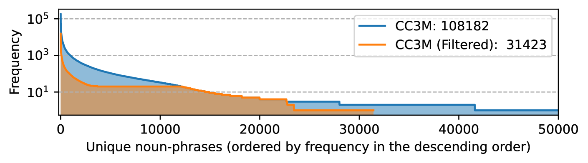
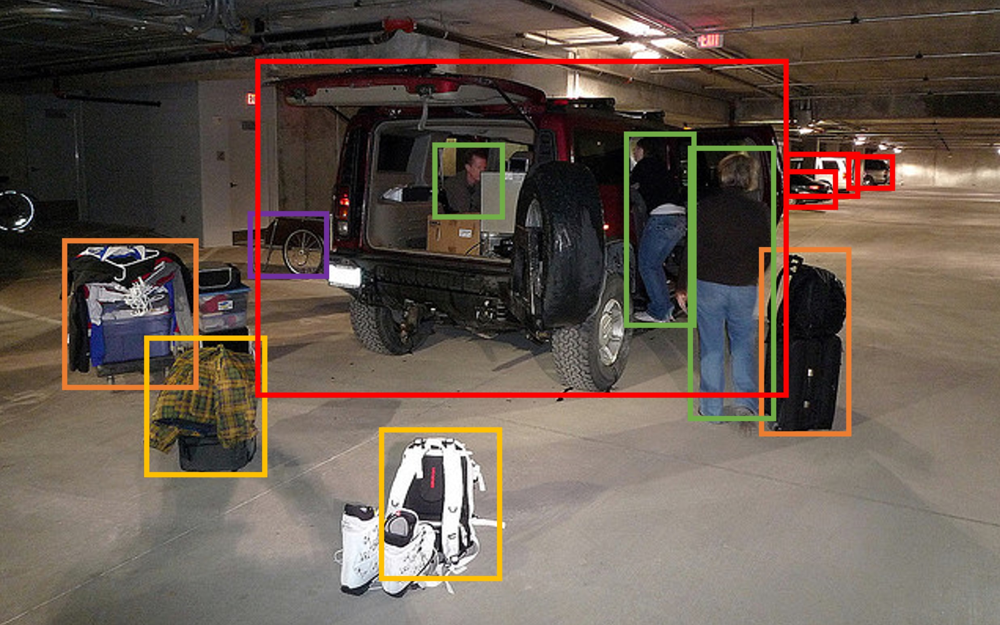
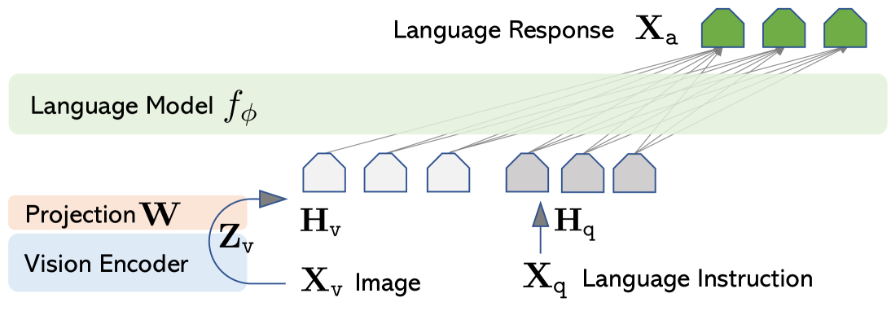
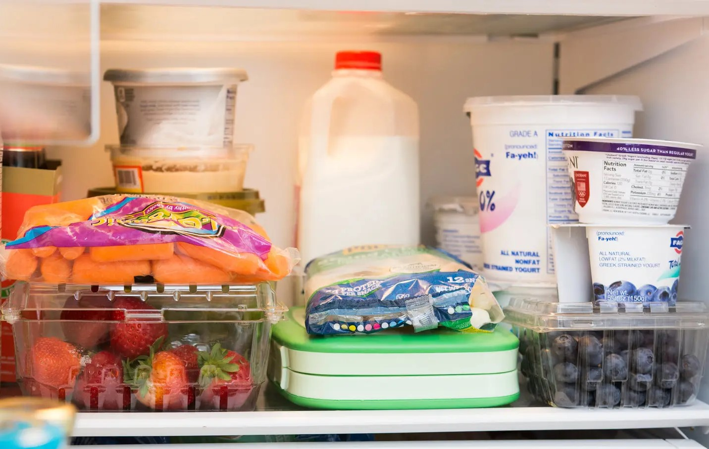

# LLaVA 论文精读报告

论文题目：**Visual Instruction Tuning**

论文版本：`arXiv:2304.08485v2`

阅读对象：LLaVA 早期论文，重点关注其**创新点、数据来源、方法设计、训练流程、实验结论、历史方法对比**，以及“为什么这篇工作后来影响很大”。

说明：本报告以论文正文、附录和公开页面为主要依据。报告中会尽量区分三类内容：

- **论文明确说明**：作者在正文、附录、表格或图中直接给出的信息。
- **基于文中信息的合理推断**：由论文内容支持、但并非逐字写出的解释。
- **目前不清楚**：论文未明确说明，或仅凭现有材料无法严格确认的部分。

## 1. 一页结论

这篇论文最重要的贡献，不是提出了一个特别复杂的新型多模态架构，而是把**视觉指令微调**系统化了：作者用 `GPT-4` 把普通图文对重组为多轮对话、详细描述、复杂推理三类视觉指令数据，再用一个非常简单的桥接结构，把 `CLIP` 接到 `Vicuna` 上，证明“**高质量视觉指令数据 + 合理训练流程**”本身就足以显著提升多模态对话和推理能力。

如果用一句话概括这篇工作的历史意义，可以写成：**LLaVA 把多模态模型研究的焦点，从“如何设计更复杂的视觉-语言连接器”部分转移到了“如何构造更像助手交互的数据和训练目标”上。**

我认为这篇论文最值得记住的亮点有五个：

- 它较早而系统地提出了**visual instruction tuning** 这一训练范式。
- 它把 `GPT-4` 用作数据教师，而教师并不直接看图，而是看**caption + bounding boxes** 这样的符号化视觉表示。
- 它故意使用一个**非常简单的线性投影层**来桥接视觉特征和语言模型，从而把改进归因尽量集中到数据与训练流程，而不是复杂结构。
- 它给出了清晰的两阶段训练策略：先做 feature alignment，再做 instruction tuning。
- 它不仅训练模型，还补充了 `LLaVA-Bench` 这类更贴近“指令跟随”的评测方式。

## 2. 论文基本信息与研究定位

- 论文题目：`Visual Instruction Tuning`
- 模型名称：`LLaVA`
- 核心任务：构建能够**理解图像并遵循自然语言指令**的多模态助手
- 论文定位：不是单一任务模型，而是面向**通用视觉对话 / 视觉问答 / 视觉推理**能力的早期开放式多模态大模型工作

从论文的叙述可以看出，作者想解决的不是“如何把图像编码进 LLM”这一单点问题，而是更接近如下目标：

- 给一个图像和一段用户指令，模型不仅要“看见图像”，还要**按用户意图组织回答**。
- 回答不能停留在简单 caption，而要能覆盖对话、细节描述和复杂推理。

这一定义和传统 captioning / 固定模板 VQA 有明显区别。作者想要的是“**视觉版 ChatGPT 式助手**”，而不是“图片描述器”。

## 3. 研究问题：这篇论文到底想解决什么

### 3.1 论文明确说明的动机

作者认为，多模态大模型要想具备真正有用的视觉对话能力，至少有两个现实障碍：

- 高质量、多样化的视觉指令跟随数据很少。
- 许多已有视觉语言模型更擅长“描述图像”，但未必擅长“遵循用户指令”。

换言之，问题并不只是“模型看不看得懂图”，而是“模型是否被训练成一个能按意图回答的视觉助手”。

### 3.2 为什么这个问题难

这个问题难在三个层面：

- **数据难**：纯文本 instruction tuning 已经证明有效，但多模态场景缺少大规模、高质量、低成本的指令数据。
- **教师难**：当时可用的最强教师模型是文本 GPT-4 / ChatGPT，它们并不能直接处理原始图像。
- **目标难**：用户的问题类型很多，既可能要求计数、定位、解释，也可能要求细致描述或多轮追问。

因此，作者真正解决的是一个组合难题：**如何让文本强教师参与视觉指令数据构造，并让一个相对简单的视觉-语言模型通过这些数据学会更像“助手”的行为。**

## 4. 数据来源与数据构造

## 4.1 训练数据由哪些部分构成

论文中出现了三套关键数据来源：

- `CC3M -> CC-595K`：用于第一阶段 feature alignment 的图文对预训练数据。
- `COCO images -> LLaVA-Instruct-158K`：用于多模态对话模型训练的视觉指令数据。
- `ScienceQA`：用于多模态推理评测与专门微调。

这三套数据分别承担不同作用，不应混为一谈。

### 4.1.1 CC-595K：第一阶段对齐数据

论文明确说明，作者从 `CC3M` 中做了过滤，得到大约 `595K` 图文对，用于第一阶段预训练。

论文附录给出了过滤策略要点：

- 对全量 `CC3M` caption 用 `SpaCy` 抽取 noun phrases。
- 频次小于 `3` 的 noun phrase 被跳过。
- 对高频 noun phrase，如果频次大于 `100`，就随机采样最多 `100` 个对应 caption。
- 最终得到大约 `595K` 图文对。

作者给出的解释是：这样做可以在**概念覆盖度**与**训练效率**之间取得平衡。



从这一步可以看出，作者并没有盲目扩大数据量，而是有意识地控制训练成本。这一点和后来许多“大模型一切靠堆数据”的做法不完全一样。

### 4.1.2 LLaVA-Instruct-158K：核心视觉指令数据

论文明确说明，多模态聊天模型训练使用的是作者构造的 `LLaVA-Instruct-158K`。

这套数据总量为：

- `58K` conversation
- `23K` detailed description
- `77K` complex reasoning

这三类数据分别覆盖了不同能力面向：

- `conversation`：多轮视觉问答与交互
- `detailed description`：更全面的视觉内容覆盖
- `complex reasoning`：要求按逻辑逐步解释、而不是只做表面描述

论文还说明，在这些数据上做早期实验时，作者比较过 `ChatGPT` 和 `GPT-4`，最后认为 `GPT-4` 生成的数据质量更高，尤其体现在空间推理上。

### 4.1.3 指令数据的图像来源

论文正文明确写到，作者使用的是 **COCO images** 来生成视觉指令数据。

重要的是：这些图像本身并不是直接输入给 `GPT-4`。作者先把图像变成文本化上下文，再去问文本 `GPT-4`。

### 4.1.4 如果按“源文件格式”理解，原始数据大致长什么样

这一点论文没有把所有中间文件逐字段展开，但结合论文描述、公开数据和训练代码，可以把训练前的数据理解成下面三层。这里我会明确区分“论文明确说明”和“为了帮助理解而给出的教学化格式”。

#### A. `CC3M` 的原始层：本质上是图文对

论文明确说明的部分只有：

- 作者从 `CC3M` 取 caption。
- 用 `SpaCy` 从 caption 中抽 noun phrase。
- 再按频次规则过滤，得到 `CC-595K`。

论文没有逐字段给出 `CC3M` 在作者本地脚本里的原始 JSON 长什么样。  
为了理解，可以先把它看成最朴素的“图片引用 + caption”结构：

```json
{
  "image_url": "http://...",
  "caption": "A group of people are packing luggage into a black SUV."
}
```

这还不是 LLaVA 最终喂给模型的格式，它只是第一阶段的“原材料”。

#### B. `COCO` 的原始层：图像文件 + caption 标注 + detection/instance 标注

论文明确说明，作者使用 `COCO images`，并把其中的 `captions` 与 `bounding boxes` 作为 `GPT-4` 的输入上下文。

为了帮助理解，可以把一张 COCO 图像的相关信息想成下面两类文件的关联结果。

第一类是图像元信息：

```json
{
  "id": 391895,
  "file_name": "000000391895.jpg",
  "width": 640,
  "height": 480
}
```

第二类是 caption 标注和 box 标注：

```json
{
  "captions": [
    {
      "image_id": 391895,
      "caption": "Several people stand near a black SUV with luggage."
    },
    {
      "image_id": 391895,
      "caption": "A family appears to be loading bags into a vehicle."
    }
  ],
  "boxes": [
    {
      "image_id": 391895,
      "category": "person",
      "bbox": [52, 61, 118, 243]
    },
    {
      "image_id": 391895,
      "category": "suitcase",
      "bbox": [350, 260, 96, 88]
    },
    {
      "image_id": 391895,
      "category": "car",
      "bbox": [129, 97, 404, 246]
    }
  ]
}
```

这里的 `bbox = [x, y, width, height]` 是 COCO 系列标注中非常常见的写法。  
需要说明的是：**论文正文没有逐字段写出作者内部脚本如何把这些 COCO 标注 merge 成最终 prompt**。但从论文的描述可以确定，至少做了下面两件事：

- 用 `image_id` 把同一张图的多条 caption 和多条 box 标注汇总到一起；
- 再把这些结构化信息改写成 `GPT-4` 可读的文本上下文。

#### C. `ScienceQA` 的原始层：题目、上下文、答案和可能附带的图像

论文明确说明，在 `ScienceQA` 上，作者把：

- 问题 + 上下文

组织成输入 `X_instruct`，再把：

- 推理过程 + 最终答案

组织成输出 `X_a`。

但论文没有在正文逐字段展开 `ScienceQA` 原始文件结构，因此如果只基于这篇论文本身，**目前无法确认作者具体读取了哪些原始键名**。这一部分更重要的是“如何重组”，而不是原 benchmark 的内部 schema。

## 4.2 创新的数据生成方式：caption + boxes -> GPT-4 指令数据

这是整篇论文最值得仔细理解的部分。

作者的关键做法是：把图像转换成文本教师模型可理解的**符号化视觉表示**，主要包括两类：

- `captions`
- `bounding boxes`

作者解释说：

- caption 从不同角度描述视觉场景。
- bounding box 既包含对象类别，也包含空间位置。

这样，虽然 `GPT-4` 不能直接看图，但它能看到足够多的“图像代理信息”。



### 4.2.1 这一步为什么有价值

这一步的重要性不在于“caption 和 box 很新”，而在于作者把它们用成了**教师提示接口**。

在这之前，常见做法往往是：

- 直接做图文对预训练；
- 或者为某个特定任务单独微调；
- 或者让 LLM 去调工具、调其他视觉模型。

LLaVA 的变化在于，它先构造一个“**视觉语义到文本教师**”的中间层，然后把教师的输出变成 instruction-tuning 数据。这使得多模态训练目标从“描述图片”转向“按任务形式回答”。

### 4.2.2 作者只用了极少量人工种子

论文明确说明，每一类数据的 prompt 中，作者只手工设计了少量 few-shot 示例，作为 in-context learning 的种子。这些少量人工示例，是数据收集过程中“唯一的人类标注”。

这意味着整套数据构造流程的成本，主要来自教师模型调用，而不是大规模人工标注。

### 4.2.3 `GPT-4` 并没有直接“读图片”

这一点非常关键，也是很多初读者最容易误解的地方。

论文明确说明，当时用于生成数据的 `GPT-4/ChatGPT` 并不是视觉版模型。它们没有直接接收：

- `jpg/png` 图片文件；
- 图像像素张量；
- 或者 `CLIP` 提取出的视觉向量。

它们真正接收的是一段**文本 prompt**。这段 prompt 里包含：

- 来自图像的多条 `captions`；
- 来自图像标注的 `bounding boxes`；
- 作者手工给出的少量 few-shot 示例；
- 以及“请生成 conversation / detail / reasoning”的任务说明。

因此，更准确的说法不是“通过 GPT 读取图片”，而是：

- 先把图片转换成**文本代理表示**；
- 再让 `GPT-4` 基于这份文本代理表示，生成视觉指令数据。

这也解释了为什么 LLaVA 的数据构造流程和后来的“真正多模态 GPT-4V 直接看图生成数据”不同。

### 4.2.4 如果把“发给 GPT-4 的内容”写成接近实现的样子

论文正文没有把完整 prompt 模板逐字贴出来。下面这个例子是**根据论文表格示例、作者描述和训练目标重构的教学化 prompt**，目的是帮助理解“数据处理到这一步时，文件内容究竟像什么”。

```text
You are an AI visual assistant.
You will be given image captions, bounding boxes, and a few examples.
Please generate:
1. A multi-turn conversation about the image.
2. One detailed description.
3. One complex reasoning QA pair.

[Few-shot Example 1]
Captions:
- A boy is holding a red frisbee in a park.
- A child prepares to throw a frisbee outdoors.
Bounding boxes:
- boy: [64, 53, 120, 250]
- frisbee: [172, 118, 46, 44]
- grass: [0, 250, 640, 230]
Output:
Conversation: ...
Detailed description: ...
Complex reasoning: ...

[Target Image]
Captions:
- Several people stand near a black SUV with luggage.
- A family appears to be loading bags into a vehicle.
Bounding boxes:
- person: [52, 61, 118, 243]
- person: [221, 67, 106, 238]
- suitcase: [350, 260, 96, 88]
- car: [129, 97, 404, 246]
Output:
...
```

这里有两个实现层面的重点。

第一，`GPT-4` 看到的是**同一张图整理出来的一整段文本上下文**，而不是一条 caption。  
第二，作者不是只让 `GPT-4` 输出一句答案，而是让它按目标任务形式输出：

- 多轮对话；
- 详细描述；
- 复杂推理问答。

这相当于在数据构造阶段，就已经把“以后模型要扮演什么样的助手”定义好了。

需要特别说明：**论文没有完全公开 box 文本化的精确模板**。例如是严格保留数值坐标，还是先转换成 `left / center / right` 这类相对位置描述，正文没有完全展开。上面的写法是为了帮助理解而给出的接近实现的示例。

### 4.2.5 如果把一条训练样本写成接近真实实现的样子

这一点论文正文没有把 JSON 结构完全展开，但从作者后续公开的数据与训练代码看，LLaVA 的训练样本通常是“**图片路径 + 对话列表**”的形式。为了帮助理解，可以把它抽象成下面这种结构。

注意：下面是**根据作者公开数据格式整理的教学示例**，不是论文正文逐字给出的原始样本。

```json
{
  "image": "COCO_train2014_000000123456.jpg",
  "conversations": [
    {
      "from": "human",
      "value": "<image>\nWhat are the people doing?"
    },
    {
      "from": "gpt",
      "value": "They are packing several suitcases into a black SUV."
    },
    {
      "from": "human",
      "value": "What challenge might they face?"
    },
    {
      "from": "gpt",
      "value": "They may have difficulty fitting all the luggage into the vehicle."
    }
  ]
}
```

这个结构里最重要的字段只有两个：

- `image`：告诉训练脚本去哪个目录加载图像。
- `conversations`：一个按顺序排列的对话列表。

其中每一轮都只有两个核心键：

- `from`
  - `human` 表示用户问题
  - `gpt` 表示目标答案
- `value`
  - 就是这一轮的文本内容

如果是单轮样本，那么 `conversations` 里就只有一问一答两条；如果是多轮对话，那么就按“人类、助手、人类、助手”交替往下排。

为了避免把不同阶段的数据混在一起，下面再给三个更具体的例子。

第一阶段 `CC-595K` 的单轮样本，语义上更接近：

```json
{
  "image": "GCC_train_002582585.jpg",
  "conversations": [
    {
      "from": "human",
      "value": "<image>\nProvide a brief description of the given image."
    },
    {
      "from": "gpt",
      "value": "olive oil is a healthy ingredient used liberally ."
    }
  ]
}
```

第二阶段 `detailed description` 的单轮样本更接近：

```json
{
  "image": "000000391895.jpg",
  "conversations": [
    {
      "from": "human",
      "value": "<image>\nDescribe the image in detail."
    },
    {
      "from": "gpt",
      "value": "The image shows several people standing beside a black SUV in a parking area while bags and luggage are arranged around the vehicle ..."
    }
  ]
}
```

第二阶段 `complex reasoning` 的单轮样本更接近：

```json
{
  "image": "000000391895.jpg",
  "conversations": [
    {
      "from": "human",
      "value": "<image>\nWhat challenge might these people face?"
    },
    {
      "from": "gpt",
      "value": "They may have trouble fitting all of the luggage into the SUV because there appear to be several large bags and limited storage space."
    }
  ]
}
```

从格式上看，这三者几乎没有区别。真正的区别在于：

- 用户问题写成什么样；
- 助手答案要求多长、偏描述还是偏推理；
- `conversations` 是单轮还是多轮。

### 4.2.6 图像在训练脚本里是怎么表示的

从作者公开训练代码看，图像不会直接混成普通字符串，而是先在文本里放一个特殊标记，例如：

- `<image>`

训练脚本在做多模态预处理时，会把这个特殊标记调整到句首，形成类似：

```text
<image>
What are the people doing?
```

如果配置里开启了图像起止标记，还可能进一步被包装成：

```text
<im_start><image><im_end>
What are the people doing?
```

这一步的直观理解是：

- 文本里先留一个“这里要插入图像”的占位符。
- 真正训练时，代码再把这块占位符替换为模型内部的视觉 token。

也就是说，用户看到的是 `<image>`，模型内部真正处理的是：

- 图像经过 `CLIP`
- 得到视觉特征
- 再由投影层映射成语言模型能接收的 embedding 序列

如果把这一步说得更具体一点，训练脚本里至少有三层“图像表示”：

第一层是**文件层**：

- `image: "000000391895.jpg"`

第二层是**文本占位符层**：

- `"<image>\nDescribe the image in detail."`

第三层是**模型内部张量层**：

- 图像经 `image_processor` 处理后得到 `pixel_values`
- 再进入 `CLIP`
- 再经过投影层，最终对应到语言模型里的视觉 token / embedding

所以 `<image>` 并不是“把像素直接写进字符串”，而是一个**索引入口**。  
它的作用是告诉 tokenizer 和模型：“这里会有一段视觉内容，需要由多模态分支来填充。”

### 4.2.7 训练数据是怎么从“图像信息”变成“问答样本”的

为了帮助你理解，可以把整个数据重组过程想成下面四步。

#### 第一步：拿到原始图像及其辅助信息

例如一张 COCO 图片里有：

- 一辆黑色 SUV
- 三个人
- 多个行李箱和背包

同时作者还能拿到这张图的：

- captions
- bounding boxes

#### 第二步：把图像改写成教师模型可读的文本上下文

例如可以写成下面这种形式：

```text
Captions:
- A black SUV is parked in a garage.
- Several people are standing near the vehicle with luggage.

Bounding boxes:
- person: left side
- person: center
- person: right side
- suitcase: near the car
- backpack: ground near the car
- SUV: center
```

这一步的作用是：让本来不能直接看图的 `GPT-4`，也能“间接理解”这张图。

#### 第三步：让 GPT-4 把上下文改写成训练对话

例如对于同一张图，作者会让 `GPT-4` 生成三种样本。

样本 A：`conversation`

```text
Human: What are the people doing?
GPT-4: They are packing luggage into a black SUV.
```

样本 B：`detailed description`

```text
Human: Describe the image in detail.
GPT-4: The image shows an underground parking area ...
```

样本 C：`complex reasoning`

```text
Human: What challenge might these people face?
GPT-4: They may struggle to fit all the luggage into the SUV ...
```

#### 第四步：整理成统一数据格式

最后这些内容会被落成统一的训练样本结构，也就是前面讲到的：

- `image`
- `conversations`

这就是为什么 LLaVA 的训练数据看上去像“对话记录”，而不是传统的“图像 + 一个标签”。

如果继续往实现层面走，还会多出一步“训练前再编码”：

- `image` 字段会触发图像文件读取；
- `conversations` 会先拼成完整 prompt；
- `<image>` 会被特殊 token 替换；
- 最后才生成 `input_ids`、`labels` 和 `image tensor`。

也就是说，`GPT-4` 输出的文本还不是最终喂给 GPU 的形式，中间还隔着一次训练脚本的编码阶段。

### 4.2.8 一些容易卡住的术语，换成白话怎么理解

下面这些术语很容易在第一次读论文时卡住，我这里尽量用白话解释。

- `caption`
  - 就是“对图片内容的一段文字描述”。
  - 例如：`A black SUV is parked in a garage.`
- `bounding box`
  - 就是“把图中某个物体框出来的矩形框”，同时附带物体类别。
  - 例如：某个框表示 `person`，另一个框表示 `suitcase`。
- `noun phrase`
  - 可以先简单理解为“名词短语”，也就是 caption 里表示对象概念的短语。
  - 例如：`black SUV`、`parking area`、`piece of luggage`。
- `few-shot example`
  - 不是大规模标注，而是少量示例，用来告诉 `GPT-4`：“你应该按这种风格生成数据。”
- `in-context learning`
  - 可以直观理解成“先给模型几个例子，再让它照着这个格式继续做”。
- `single-turn conversation`
  - 一问一答。
- `multi-turn conversation`
  - 连续多轮问答，后一个问题可以依赖前面的上下文。
- `feature alignment`
  - 可以先粗略理解为“让视觉特征先学会说语言模型听得懂的话”。
- `instruction tuning`
  - 可以理解为“把模型训练成更会按指令回答，而不是只会随便描述”。
- `mask 掉 human tokens`
  - 表示训练时不要求模型去“预测用户问题”，只要求它学会“生成助手答案”。

## 5. 方法总结：LLaVA 模型怎么搭的

## 5.1 架构概览

作者采用了一个非常克制的结构：

- 视觉编码器：`CLIP ViT-L/14`
- 语言模型：`Vicuna`
- 融合方式：把 `CLIP` 的 grid feature 通过一个**可训练线性投影层**映射到语言模型词向量空间



{{LLAVA_ARCH_DIAGRAM}}

上图是根据论文逻辑重绘的简化流程图，用来帮助理解训练与数据流。与原论文一致，核心路线就是：

- 图像进入 `CLIP`
- 视觉特征经过线性投影器
- 投影后的视觉 token 与文本指令一起送入 `Vicuna`
- 通过自回归目标预测回答

## 5.2 为什么说它的结构很简单

论文明确承认，作者这里选的是一种**轻量、简单**的桥接方式。

作者还主动把自己的方法和更复杂的连接器做了区分：

- `Flamingo` 使用 gated cross-attention
- `BLIP-2` 使用 `Q-Former`

LLaVA 没有走这条路线，而是故意选线性投影层。作者给出的理由是：简单结构有利于更快迭代**数据中心实验**。

这其实是论文的一个重要信号：作者想证明的重点不是“我有更强连接器”，而是“即使连接器很简单，只要数据形态和训练目标对了，也能显著提升表现”。

## 5.3 原理解释：为什么一个线性投影层也可能有效

如果只从表面看，这个结构很容易让人疑惑：为什么只加一层线性映射，就能把图像接到语言模型上？

从原理上看，LLaVA 能成立，至少依赖三点前提。

第一，`CLIP` 本身已经不是“纯视觉底层特征”。  
`CLIP` 是用图文对比学习训练出来的，因此它的视觉特征天然带有一定的语言语义。也就是说，`CLIP` 输出并不是简单的颜色和边缘，而已经部分对齐到“物体、动作、场景”这类语言概念空间。

第二，`Vicuna` 本身已经具备较强的语言组织能力。  
它知道如何根据上下文续写、如何按问答格式回答、如何组织较长解释。因此 LLaVA 并不需要从零训练一个“会推理、会表达”的模型，而只需要解决一个更窄的问题：

- 怎样把视觉信息送进这个已经会说话的语言模型。

第三，投影层做的不是“从零学会看图”，而是“把已有语义搬运到另一个向量空间”。  
如果把 `CLIP` 看成说“视觉语”，把 `Vicuna` 看成说“语言语”，那么线性投影层更像一个小型翻译接口，而不是一个完整视觉系统。

如果写成最简形式，可以把它理解为：

```text
v = CLIP(image)
z = W * v
h = [z, text_embeddings]
loss = -sum_t log p(answer_t | answer_<t, question, z)
```

这里：

- `v` 是图像的视觉特征；
- `W` 是可训练投影层；
- `z` 是映射到语言空间后的视觉表示；
- `h` 是送入 `Vicuna` 的联合上下文；
- loss 只在答案 token 上计算。

这个过程能工作的关键，不在于 `W` 很强，而在于：

- `CLIP` 已经提供了较强的语义起点；
- `Vicuna` 已经提供了较强的生成起点；
- `W` 只需要把两边“接起来”。

当然，这也意味着它的上限受限。  
如果需要非常细粒度的区域选择、跨 patch 精细交互或复杂视觉重采样，仅靠一个线性层通常不如更复杂的 cross-attention / query-based 连接器。

## 5.4 原理解释：为什么 `caption + boxes` 足以驱动数据生成

论文里另一个容易被低估的点是：作者并没有让 `GPT-4` 直接看图，却仍然生成出了可用的视觉指令数据。

这背后的原理可以拆成“全局语义 + 局部结构”两部分。

### 5.4.1 caption 提供全局语义

caption 往往能告诉教师模型：

- 场景是什么；
- 主要对象有哪些；
- 主要动作是什么；
- 整体事件大致如何理解。

例如：

```text
A family appears to be loading bags into a vehicle.
```

这句话虽然没有精确框出每个物体，但已经告诉 `GPT-4`：

- 有家庭成员
- 有袋子/行李
- 有车辆
- 正在发生“装载”这一动作

这足以支撑很多高层问题，比如：

- 他们在做什么？
- 场景可能发生在哪里？
- 接下来可能遇到什么问题？

### 5.4.2 bounding box 提供局部对象与空间线索

caption 的弱点是经常漏细节、漏位置。  
box 则补上了：

- 对象类别
- 对象数量
- 粗略空间位置

例如：

```text
- person: [52, 61, 118, 243]
- person: [221, 67, 106, 238]
- suitcase: [350, 260, 96, 88]
- car: [129, 97, 404, 246]
```

即使 `GPT-4` 不真正“看见”图片，它也能根据这些信息推断：

- 图中至少有两个人；
- 有行李箱；
- 车辆占据较大区域；
- 行李和车可能存在空间关系。

这对于生成：

- 计数类问题
- 相对位置类问题
- 场景推理类问题

都已经足够有用。

### 5.4.3 两者结合后，教师模型其实拿到了一个“压缩后的图片说明书”

所以 `caption + boxes` 的真正作用，不是完美重建原图，而是给 `GPT-4` 一份足够强的、结构化的图像摘要。

可以把它理解成：

- caption 负责说“这张图整体在讲什么”
- boxes 负责说“图里有哪些对象、它们大概在哪里”

当这两部分合起来时，教师模型就能围绕同一张图生成多种问题形式。  
这也是为什么 LLaVA 的数据管线虽然简化，但仍然有效。

不过这套方法也有明确边界：

- 如果图像里有非常细的属性差异，caption 可能漏掉；
- 如果对象关系很复杂，box 只能给出粗位置，未必足以恢复完整语义；
- 如果原始 caption 或检测结果有误，生成的数据也会被污染。

## 6. 训练流程：两阶段策略

在补充实现细节之前，可以先把整条训练流水线压缩成一句话：

- **第一阶段**先教模型“看图后怎么接上语言模型”。
- **第二阶段**再教模型“接上之后应该怎样像助手一样回答”。

如果换成更口语化的理解：

- 第一阶段像是在给视觉模块配一个“翻译器”。
- 第二阶段像是在教整个系统“说什么话、按什么方式说”。

## 6.1 第一阶段：Feature Alignment

第一阶段使用 `CC-595K` 图文对做特征对齐。

关键设置：

- 冻结视觉编码器
- 冻结 LLM
- 只训练投影层 `W`

训练样本组织方式是：

- 输入：图像 + 一个随机采样的“请简要描述图像”的自然语言指令
- 目标：原始 caption

作者把这一阶段理解为：为冻结的 LLM 学出一个**兼容的视觉 tokenizer**。

这是一种很值得注意的理解。严格说它并不是真的离散 tokenizer，但在功能上，它确实在做“把视觉特征变成语言模型可以消费的 token 序列”。

### 6.1.1 第一阶段的一条样本到底长什么样

这一步最容易让人困惑，因为论文里说的是“图文对做对齐”，但实际训练形式已经被改造成了“单轮对话”。

例如原始图文对可能是：

- 图像：一辆黑色 SUV 和几个人在停车场整理行李
- caption：`A group of people are packing luggage into a black SUV in a parking garage.`

作者不会直接把这条数据写成：

```text
image -> caption
```

而是会先改写成类似：

```text
Human: <image>
Describe the image concisely.

Assistant: A group of people are packing luggage into a black SUV in a parking garage.
```

这里的关键是：

- `Human` 部分相当于“任务指令”
- `Assistant` 部分相当于“监督答案”

所以第一阶段虽然还是在用 caption，但已经不是传统 caption training 的格式了，而是 instruction format。

### 6.1.2 第一阶段的训练时，模型内部发生了什么

如果把“训练时到底喂了什么”说得更细，可以把这一阶段拆成 10 个步骤，而且每一步的数据格式都不一样。

#### 步骤 0：磁盘上的原始样本

从作者公开训练代码看，数据集读取器最终期待的是一个 JSON 列表，每条样本至少包含：

```json
{
  "image": "GCC_train_002582585.jpg",
  "conversations": [
    {
      "from": "human",
      "value": "<image>\nProvide a brief description of the given image."
    },
    {
      "from": "gpt",
      "value": "olive oil is a healthy ingredient used liberally ."
    }
  ]
}
```

需要说明两点：

- 论文正文没有逐字段展示这个 JSON；这是根据作者公开训练代码归纳出的实际训练接口。
- 某些公开镜像数据集会把键名写成 `file_name / conversation / role / content`，语义相同，但和训练脚本期望的 `image / conversations / from / value` 不是完全同一套键名。

#### 步骤 1：`Dataset.__getitem__` 读图片文件

训练器拿到这一条 JSON 后，会先读取：

- `image`
- `conversations`

其中 `image` 会被拼到 `image_folder` 上，随后用 `PIL.Image.open(...).convert('RGB')` 打开。

这一步结束后，图片还不是 tensor，而只是一个 `PIL.Image` 对象。

#### 步骤 2：图像预处理成 `pixel_values`

作者公开代码里，图像会交给 `image_processor.preprocess(...)`。  
如果配置了 `image_aspect_ratio = pad`，脚本还会先把非正方形图片补成正方形，再转成模型输入张量。

这一阶段结束后，图像大致变成：

```text
image tensor: [3, H, W]
```

其中：

- `3` 表示 RGB 三个通道；
- `H` 和 `W` 是处理后的高和宽；
- 这个张量稍后会作为 batch 里的 `images` 字段送进模型。

#### 步骤 3：图像进 `CLIP`

图像先经过 `CLIP ViT-L/14`，得到一串视觉特征。

如果把图像比作一篇文章，那么这串视觉特征可以先粗略理解成：

- “这张图被切成很多局部 patch 后得到的表示”

#### 步骤 4：视觉特征经过线性投影层

这些视觉特征原本不在 `Vicuna` 的词向量空间里，所以作者用一个可训练投影层 `W` 把它们映射过去。

这一层可以先理解成：

- 一个“视觉语 -> Vicuna 语”的小翻译器

#### 步骤 5：文本侧先做多模态占位符整理

在视觉分支工作之前，文本侧的 `conversations` 也会先经过 `preprocess_multimodal()`。  
这一步主要做三件事：

- 如果句子里有 `<image>`，先把它抽出来放到句首；
- 统一成 `<image>\n问题文本` 这种格式；
- 如果配置开启 `mm_use_im_start_end`，再替换成 `<im_start><image><im_end>`。

也就是说，训练前 JSON 里的：

```text
What are the people doing? <image>
```

会被整理成：

```text
<image>
What are the people doing?
```

这样做的目的，是让不同来源数据在进入 tokenizer 之前先统一格式。

#### 步骤 6：把视觉 token 和文本指令拼成统一序列

训练脚本会把：

- 图像 token
- 用户指令

拼在同一条序列里。论文还提到，首轮里图像和问题的顺序可以随机化。

直观上，你可以把它看成下面两种等价写法之一：

```text
<image>
Describe the image concisely.
```

或者：

```text
Describe the image concisely.
<image>
```

作者这样做，是为了避免模型过分依赖一种固定输入顺序。

#### 步骤 7：把完整对话编码成 `input_ids`

这一阶段代码会把整段对话模板化，然后交给 tokenizer。  
如果样本里带图像，就会调用 `tokenizer_image_token(...)`，把 `<image>` 占位符替换成专门的图像 token index。

因此，这一步结束后的文本输入已经不是字符串，而更接近：

```text
input_ids = [1, 3148, 11889, ..., IMAGE_TOKEN_INDEX, ..., 29871]
```

这里不用把每个数字背下来，只要理解：

- 每个数字是一个 token id；
- 其中有专门的位置代表图像 token；
- 整条序列仍然是按自回归语言模型的方式排布。

#### 步骤 8：只让模型学习“回答部分”

这一点从作者公开训练代码里能看得更清楚。训练时会把：

- 用户问题部分
- 系统提示部分

对应的 token label 设成 `IGNORE_INDEX`，也就是**不计算损失**。

真正参与 loss 的，主要是：

- 助手回答部分的 token

换成白话就是：

- 训练时不逼模型去背问题
- 只逼模型学会“在看到问题后生成正确答案”

从数据结构上看，可以把 `labels` 理解成“和 `input_ids` 一样长，但很多位置被改成 `IGNORE_INDEX`”：

```text
input_ids: [BOS, Human, :, <image>, Describe, the, image, ..., Assistant, :, A, group, of, people, ...]
labels:    [ -100,  -100, -100,   -100,   -100,    -100, -100, ...,      -100, -100,  A, group, of, people, ...]
```

这里常见的 `-100` 就是 `IGNORE_INDEX`。  
它的意思不是“这个 token 不存在”，而是“这个位置不要算 loss”。

#### 步骤 9：`collator` 把多条样本拼成一个 batch

单条样本到这里还不能直接训练，因为不同样本长度不同。  
`DataCollatorForSupervisedDataset` 会做三件事：

- 用 `pad_token_id` 对齐 `input_ids`；
- 用 `IGNORE_INDEX` 对齐 `labels`；
- 生成 `attention_mask`，标记哪些位置是真实 token、哪些只是 padding。

最后一个 batch 在概念上更接近：

```text
input_ids:      [batch_size, seq_len]
labels:         [batch_size, seq_len]
attention_mask: [batch_size, seq_len]
images:         [batch_size, 3, H, W]
```

这才是优化器真正看到的数据形态。

#### 步骤 10：只更新投影层

第一阶段里：

- `CLIP` 冻结
- `Vicuna` 冻结
- 只训练投影层 `W`

这样做的好处是：

- 训练稳定
- 参数少
- 能先把视觉表示接到语言模型上，而不破坏原有语言能力

### 6.1.3 为什么第一阶段不能直接省略

论文的消融已经说明，省略第一阶段会明显掉点。

这在直觉上也合理，因为如果不先做这一层“视觉到语言的对齐”，第二阶段 instruction tuning 就变成了：

- 一边学会看图
- 一边学会对话

两个难题同时解决，优化会更困难。

### 6.1.4 原理解释：第一阶段到底在优化什么

如果只看训练脚本，很容易觉得第一阶段只是“先训一下 projector”。  
但从优化角度看，它实际在解决一个非常具体的问题：**让语言模型先学会把视觉 token 当成“有意义的上下文”来使用。**

更准确地说，第一阶段并不是在教 `Vicuna` 重新学语言，而是在建立下面这条条件关系：

```text
看到 z 和问题 “Describe the image concisely.”
-> 输出与图像匹配的 caption
```

其中 `z` 就是投影后的视觉表示。

为什么这一步重要？因为在训练开始时：

- `CLIP` 输出的向量对 `Vicuna` 来说是陌生的；
- `Vicuna` 并不知道这些视觉 token 应该如何影响后续生成；
- 如果直接上复杂问答，模型很可能把视觉输入当噪声。

第一阶段相当于先做一个较容易的条件生成任务：

- 问题形式几乎固定；
- 目标答案是 caption；
- 监督信号比较直接。

这样模型先学到的是：

- “看到这类视觉 token 时，我应该生成与图像内容一致的词。”

等这个基本映射建立之后，第二阶段再加入：

- 多轮对话
- 细节描述
- 复杂推理

难度就会低很多。

如果用一个直观比喻，第一阶段像是在先教学生“看图说话”，而第二阶段才开始教他“按提问方式作答、解释和推理”。

## 6.2 第二阶段：End-to-End Fine-tuning

第二阶段继续冻结视觉编码器，但更新：

- 投影层
- LLM 参数

这一阶段分两种场景：

- 多模态聊天：使用 `LLaVA-Instruct-158K`
- ScienceQA：把题目、上下文、推理和答案组织成单轮对话格式进行训练

论文中还给出了训练细节：

- 第一阶段在 `CC-595K` 上训练 `1` epoch，学习率 `2e-3`，batch size `128`
- 第二阶段在 `Instruct-158K` 上训练 `3` epochs，学习率 `2e-5`，batch size `32`
- 使用 `8 x A100`
- 预训练约 `4` 小时，指令微调约 `10` 小时，ScienceQA 微调约 `4` 小时

这些数字说明：至少在论文这一版设定下，LLaVA 并不是一个需要极大训练预算才能复现的方案。

### 6.2.1 第二阶段的核心目标：教模型“如何回答”，而不是“如何接上”

如果说第一阶段的重点是“接通”，那么第二阶段的重点就是“行为对齐”。

此时作者不再满足于：

- 图像特征能被 Vicuna 接收

而是要继续训练模型，让它学会：

- 如何像助手一样回答
- 如何做多轮对话
- 如何给细致描述
- 如何做较长的解释型推理

### 6.2.2 第二阶段里，三类训练数据分别怎么喂进去

#### A. Conversation 样本

例如一条多轮 conversation 数据可以写成：

```text
Human: <image>
What are the people doing?
Assistant: They are packing luggage into a black SUV.
Human: How many people are visible?
Assistant: Three people are visible.
```

这种样本的特点是：

- 有历史轮次
- 后面的回答依赖前面的上下文
- 更接近真实聊天

#### B. Detailed description 样本

这类样本通常就是一问一答：

```text
Human: <image>
Describe the image in detail.
Assistant: The image shows an underground parking area ...
```

这种样本的作用是：

- 逼模型覆盖更多视觉细节
- 减少只回答一句短句的倾向

#### C. Complex reasoning 样本

例如：

```text
Human: <image>
What challenge might these people face?
Assistant: They may have trouble fitting all the luggage into the SUV ...
```

这种样本和普通描述最大的区别在于：

- 回答不只是把图里东西念一遍
- 而是要把对象关系、场景逻辑和常识结合起来

### 6.2.3 第二阶段的数据在代码里是怎样处理的

从作者公开训练代码看，这一步一般包含下面几个实现动作：

#### 动作 1：读取一条样本

训练器先拿到一条样本，其中包含：

- 图片路径
- `conversations` 列表

一个典型多轮样本在磁盘上大致是：

```json
{
  "image": "000000215677.jpg",
  "conversations": [
    {
      "from": "human",
      "value": "<image>\nWhat skill set might someone need to perform such a frisbee trick?"
    },
    {
      "from": "gpt",
      "value": "They would likely need balance, hand-eye coordination, body control, and a lot of practice with frisbee handling."
    },
    {
      "from": "human",
      "value": "Why is balance important here?"
    },
    {
      "from": "gpt",
      "value": "Balance helps the person control their posture while executing the trick so the frisbee can be manipulated accurately."
    }
  ]
}
```

如果是 `detailed description` 或 `complex reasoning`，通常也是同一个 schema，只是 `conversations` 只包含一问一答。

#### 动作 2：多模态预处理

如果某一轮里出现 `<image>` 标记，代码会：

- 把它挪到句首
- 按配置决定是否包上图像起止 token

#### 动作 3：拼接成完整对话 prompt

代码会根据对话模板，把每轮内容拼成一个完整字符串。  
例如把多轮内容拼成：

```text
System: ...
Human: <image>
What are the people doing?
Assistant: They are packing luggage into a black SUV.
Human: How many people are visible?
Assistant: Three people are visible.
```

#### 动作 4：分词和图像 token 化

然后训练脚本会：

- 对文本做 tokenizer
- 对 `<image>` 占位符插入图像 token

从实现角度讲，最终送进模型的不是“原始字符串”，而是：

- 文本 token id
- 图像特征对应的 embedding/token

可以把这一步理解成两个并行通道：

- 文本通道：`conversations -> prompt string -> input_ids`
- 图像通道：`image file -> image_processor -> pixel_values -> CLIP features`

最后模型前向时，这两个通道才在多模态模块里汇合。

#### 动作 5：构造 label，并 mask 掉不该学的部分

这一点非常重要。  
训练 label 并不是整条序列都参与监督，而是：

- `Human` 说的话基本被 mask 掉
- `Assistant` 的回答保留为训练目标

这就是为什么它本质上仍然是一个**自回归语言建模目标**，只是监督只作用在回答段上。

如果把 batch 输出写成接近代码实际返回的结构，可以抽象成：

```python
{
  "input_ids": torch.LongTensor(shape=[B, L]),
  "labels": torch.LongTensor(shape=[B, L]),
  "attention_mask": torch.BoolTensor(shape=[B, L]),
  "images": torch.FloatTensor(shape=[B, 3, H, W])
}
```

其中：

- `B` 是 batch size；
- `L` 是 padding 后的序列长度；
- `labels` 中被 mask 的位置通常是 `IGNORE_INDEX`；
- `images` 是这一批图像经过预处理后的像素张量。

所以从工程实现上说，LLaVA 的训练不是直接把“对话文本 + 图片文件名”喂进去，而是经过了：

1. JSON 解析
2. 图像加载与 resize/pad
3. `<image>` 占位符重写
4. prompt 模板拼接
5. tokenizer 编码
6. label mask
7. batch padding

这 7 步之后，才进入标准的 `Trainer` 训练循环。

### 6.2.4 为什么 detailed description 和 complex reasoning 能帮 conversation

论文消融显示，这两类数据不仅提升自身任务，还会反过来提升 conversation。

这背后的直觉可以这样理解：

- `conversation` 教模型怎么问答
- `detailed description` 教模型怎么看得更全
- `complex reasoning` 教模型怎么把信息组织成更长、更合理的解释

所以它们不是三套互相独立的能力，而是三种互补的训练信号。

### 6.2.5 原理解释：为什么第二阶段只监督 `assistant` 回答

很多初学者看到 `labels` 里大量位置都被设成 `IGNORE_INDEX`，会觉得这是不是“浪费数据”。  
其实不是。这正是 instruction tuning 的关键原理之一。

模型训练的目标，不是复述整段对话，而是学习：

- 在给定问题、上下文和图像后
- 生成合理的助手回答

如果连 `human` 的问题也一起当作预测目标，会带来两个问题。

第一，会把训练目标搞偏。  
模型会被迫同时学习：

- 用户通常会怎么提问；
- 助手应该怎么回答。

但我们真正关心的是第二件事，而不是让模型擅长“背题目模板”。

第二，会削弱条件生成的意义。  
在对话设定里，`human` 内容本来就是已知条件；已知条件不应再被当作待预测目标。

因此，LLaVA 采用的其实是标准的条件语言建模思路：

- `human`、system prompt、图像 token 是条件
- `assistant` 回答是预测目标

这样 loss 的含义就很清楚了：

- 如果模型在回答段预测错了，下次就调整参数；
- 如果只是问题段存在 token，它不会因为“没把问题背出来”而被惩罚。

这也是为什么报告里一直强调：

- `input_ids` 是“给模型看的完整上下文”
- `labels` 是“真正拿来算损失的监督位置”

两者长度相同，但监督范围不同。

### 6.2.6 原理解释：为什么三类数据能共同塑造“助手行为”

从更高层的角度看，第二阶段不是单纯提高视觉识别率，而是在塑造模型的回答分布。

同一张图像，如果训练中只出现一种问题形式，模型就会形成单一回答习惯。  
例如，如果它几乎总是被要求“简短描述图片”，那么它学到的最优策略就可能是：

- 总是输出一两句概括；
- 尽量避免展开解释；
- 遇到推理类问题也倾向于给表层回答。

而 LLaVA 把三类样本放在一起，本质上是在扩大条件分布：

- `conversation` 教它处理上下文依赖和轮次延续；
- `detailed description` 教它在需要时展开更多视觉细节；
- `complex reasoning` 教它在需要时输出更长、更有逻辑结构的解释。

因此，第二阶段学到的不只是“图里有什么”，还包括：

- 什么问题对应什么回答风格；
- 什么时候应该短答，什么时候应该展开；
- 什么时候要描述事实，什么时候要给出解释。

这也是为什么我会把第二阶段理解为“行为对齐”，而不只是“继续微调”。

## 6.3 ScienceQA 的训练样本怎么处理

这一部分用户第一次读时也很容易混淆，因为 ScienceQA 不是作者生成的新数据，而是已有 benchmark 被重新包装进 LLaVA 训练框架。

论文明确说，作者把：

- 问题 + 上下文

作为输入 `X_instruct`，再把：

- 推理过程 + 最终答案

作为输出 `X_a`。

### 6.3.1 一个教学化示例

例如某道题可能抽象成下面这种格式：

```text
Human: <image>
Question: Which object will melt first?
Choices: (A) ice cube (B) metal spoon (C) plastic cup
Context: Think about temperature and material properties.

Assistant: The ice cube will melt first because it is already in a solid state that changes with heat. Answer: A
```

这里最重要的不是这道题本身，而是组织方式：

- 题目和上下文被塞进“用户输入”
- 推理和答案被塞进“助手输出”

所以 ScienceQA 在 LLaVA 里也被统一成了“对话监督学习”的接口。

### 6.3.2 为什么这种重组有意义

因为这样一来，LLaVA 不需要为每个 benchmark 单独设计一套输出头或损失函数，而是统一用：

- 图像 / 文本输入
- 自回归文本输出

来处理不同任务。

这也是 LLaVA 论文一个很重要的工程哲学：

- 尽量用统一的数据接口
- 尽量用统一的训练目标
- 把多任务差异更多留给数据组织去解决

## 7. 创新点详细分析

## 7.1 创新点一：把 visual instruction tuning 明确提出并验证

这是最核心的创新点。

在 LLaVA 之前，多模态模型当然已经存在，但很多工作更接近下面几类：

- 做大规模图文预训练，提高表示能力
- 针对 VQA / caption / retrieval 等单任务优化
- 用 LLM 调用外部视觉工具，形成组合式 agent

LLaVA 的新意在于：作者把“**像聊天助手那样处理视觉任务**”作为明确训练目标，并把 instruction-following 数据构造、训练和评测连成了一条闭环。

这使得模型目标发生了变化：

- 以前更像“看图后输出一句描述”
- 现在更像“接到指令后，结合图像组织回答”

这是一个训练目标层面的变化，而不是单纯的模型模块变化。

## 7.2 创新点二：让文本 GPT-4 通过符号化视觉表示来充当数据教师

这一步非常巧。

如果教师模型不能直接看图，常见想法是“那就不能用它做多模态监督”。LLaVA 的思路是反过来的：

- 不要求教师看原图
- 只要求教师看足够好的图像代理表示

于是作者把 caption 和 boxes 组织成 prompt，上下文足够丰富时，`GPT-4` 就能生成：

- 更像人类提问风格的多轮对话
- 更详细的图片描述
- 更偏逻辑链条的复杂推理答案

这使得强文本模型第一次比较自然地融入到多模态 instruction 数据生成里。

## 7.3 创新点三：用简单桥接结构强调“数据比复杂连接器更重要”

如果作者也采用复杂视觉桥接器，那么论文结果很难说明性能提升到底来自哪里。

但 LLaVA 的桥接结构很简单：

- 冻结 `CLIP`
- 冻结 / 部分更新 `Vicuna`
- 中间只用一个投影层

这让论文的主要贡献边界更加清楚：

- 它不是以结构创新为中心的工作。
- 它更像一篇“**多模态数据与训练范式创新**”论文。

从研究方法角度看，这种选择是克制且有说服力的。

## 7.4 创新点四：提出更贴近对话能力的评测方式

作者不仅报告 ScienceQA 这样的 benchmark，还构建了：

- `LLaVA-Bench (COCO)`
- `LLaVA-Bench (In-the-Wild)`

前者更偏可控评测，后者更偏开放域、挑战性样本。

这两个 benchmark 的意义在于：它们评的不是“答对一个封闭选择题”，而是“能否合理跟随视觉指令、进行描述和推理”。

## 8. 与历史方法的详细对比

说明：下面的对比主要用于说明 **LLaVA 在方法谱系中的位置**。其中关于历史方法的简述，以论文引用关系和这些方法的常见设计为基础；如果要做逐篇严格考据，仍建议分别精读对应原论文。

### 8.1 与 Visual ChatGPT / MM-REACT / VisProg / ViperGPT 的对比

这类方法的总体思路，是让 LLM **调用外部视觉工具或程序模块** 来完成多模态任务。

它们的优点通常是：

- 系统模块化，便于插拔
- 可以复用现成视觉模型能力
- 对复杂任务可以走工具链

但它们的局限通常也很明显：

- 更像“LLM 控制器 + 外部工具集合”，而不是一个端到端视觉语言模型
- 交互能力很大程度上依赖工具调用链
- 输出风格和对话一致性不一定稳定

LLaVA 和它们的核心差别是：

- LLaVA 追求的是**端到端训练的多模态模型**
- 它希望把视觉理解和语言生成放进同一个回答过程里
- 它更强调“像助手一样回答”，而不是“像调度器一样调工具”

因此，LLaVA 的创新不是“比工具系统更全”，而是“把多模态助手的核心能力尽量内化到单个模型里”。

### 8.2 与 Flamingo / OpenFlamingo 的对比

`Flamingo` 路线更强调：

- 利用强大的预训练视觉编码器和语言模型
- 通过更复杂的交叉注意力结构完成多模态条件化
- 依靠大规模多模态数据和 in-context learning 获得 few-shot 泛化

论文也明确提到，`Flamingo` 可被视为多模态领域的 “GPT-3 moment”。

LLaVA 和它的差异主要在三点：

- `Flamingo` 更偏**大规模预训练与结构设计**
- `LLaVA` 更偏**指令数据构造与行为对齐**
- `LLaVA` 的桥接器远比 `Flamingo` 简单

如果用一句话概括：

- `Flamingo` 更像“先把通用多模态能力做强”
- `LLaVA` 更像“把视觉行为对齐成助手式交互”

对 `OpenFlamingo` 也是类似。LLaVA 论文在 benchmark 中显示，OpenFlamingo 的回答常常更接近图像描述，而不是严格跟随用户指令。

### 8.3 与 BLIP-2 的对比

`BLIP-2` 的代表性设计是：

- 冻结视觉编码器
- 冻结大语言模型
- 用 `Q-Former` 做高效的信息桥接

这条路线非常强调“如何在冻结大模型的前提下，有效抽取和压缩视觉信息”。

LLaVA 和 BLIP-2 的区别在于关注重点不同：

- `BLIP-2` 更关注**跨模态表示桥接效率**
- `LLaVA` 更关注**指令跟随能力与对话行为**

从作者自己的写法也能看出来，他们把 `Q-Former` 当成更复杂、但并非本文重点的结构替代项。

这意味着：

- 如果问题是“如何更优地把视觉信息塞进 LLM”，BLIP-2 更像结构导向方案
- 如果问题是“如何让模型变成视觉助手”，LLaVA 更像数据与训练目标导向方案

### 8.4 与 LLaMA-Adapter 的对比

`LLaMA-Adapter` 的代表思路是对 LLaMA 做轻量适配，让语言模型更容易接收额外模态信息。

从谱系上看，它与 LLaVA 有相似处：

- 都属于“把视觉输入接到 LLaMA 类语言模型上”的开放式尝试
- 都强调较轻量的改造方式

但差异在于：

- `LLaMA-Adapter` 更偏参数高效适配
- `LLaVA` 更强调视觉 instruction 数据、对话行为和视觉推理

在论文的 `ScienceQA` 结果中，LLaVA 单模型平均准确率 `90.92`，高于表中的 `LLaMA-Adapter` `85.19`。这个结果支持作者的一个核心论点：**数据组织与训练目标设计本身，能带来很大增益。**

## 9. 用例子解释创新方法的实现原理

## 9.1 例子：一张“停车场装行李”的图，如何变成多条训练样本

论文在 Table 1 / Table 14 里给了一个很好的例子：

- 图像里有黑色 SUV
- 有多人
- 有多个行李箱和背包
- 有 caption
- 有检测框与对象标签

作者并不是直接把图像给 `GPT-4`，而是把如下信息组织成文本 prompt：

- 若干 caption
- 每个 box 对应的对象名称与位置
- 少量人工写的 few-shot 示例

然后要求 `GPT-4` 生成三种响应：

- **Conversation**
  - 例如：图里发生了什么？
  - 例如：这些人正在做什么？
- **Detailed description**
  - 让模型输出更全面的场景描述
- **Complex reasoning**
  - 例如：这些人面临什么挑战？
  - 合理回答会提到：他们要把很多行李装进 SUV，因此面临装载空间和整理问题

这一步体现的实现原理是：

- caption 负责给出全局语义
- boxes 负责补充对象与位置细节
- GPT-4 负责把“场景信息”改写成“指令-回答对”
- 最终产物不是普通 caption，而是更像用户真实交互的训练样本

因此，LLaVA 的关键不是简单做监督微调，而是先**把监督目标转换成助手交互格式**。

## 9.2 例子：为什么复杂推理数据有用

如果只训练 caption 或普通问答，模型更容易学会“看见什么说什么”。

但复杂推理数据要求的是：

- 从视觉事实出发
- 结合常识或场景逻辑
- 组织成更长、更像解释的回答

以“停车场装行李”为例：

- 普通描述只会说“有几个人和一辆 SUV”
- 复杂推理会进一步问“他们面临什么挑战”
- 回答必须把“多人 + 多件行李 + SUV 装载任务”联系起来

这类训练会推动模型学会一种更接近“解释型助手”的回答风格。

## 9.3 例子：论文自己给出的失败说明了什么

论文在 `LLaVA-Bench (In-the-Wild)` 的冰箱案例里指出：

- 图中同时有草莓和酸奶
- 但模型会把这件事误答成“有草莓味酸奶”

作者把这类失败概括为：模型有时把图像当成“**bag of patches**”。

这说明：

- 模型确实能看到许多局部对象
- 但未必能稳定建模这些局部对象之间的**组合语义**

这也是为什么 LLaVA 虽然在行为对齐上很成功，但在精细语义组合上仍然有限。



## 10. 创新方法的伪代码实现

下面的伪代码不是论文逐字给出的代码，而是依据论文流程整理出的简化实现框架，用于帮助理解。

### 10.1 伪代码一：GPT-4 生成视觉指令数据

```python
def build_visual_instruction_data(coco_images, fewshot_examples):
    dataset = []
    for image in coco_images:
        captions = get_captions(image)
        boxes = get_bounding_boxes(image)

        symbolic_context = {
            "captions": captions,
            "boxes": boxes,
        }

        for task_type in [
            "conversation",
            "detailed_description",
            "complex_reasoning",
        ]:
            prompt = make_gpt4_prompt(
                task_type=task_type,
                context=symbolic_context,
                fewshot_examples=fewshot_examples[task_type],
            )
            response = gpt4(prompt)
            sample = {
                "image": image,
                "task_type": task_type,
                "context": symbolic_context,
                "response": response,
            }
            dataset.append(sample)
    return dataset
```

这段伪代码想表达的关键点是：

- `GPT-4` 的输入不是 raw image，而是 `symbolic_context`
- few-shot 示例只需要少量人工编写
- 输出数据天然就是 instruction-following 形式

### 10.2 伪代码二：两阶段训练

```python
def stage1_feature_alignment(cc595k, clip_encoder, projector, vicuna):
    freeze(clip_encoder)
    freeze(vicuna)
    train(projector)

    for image, caption in cc595k:
        question = sample_brief_description_prompt()
        visual_tokens = projector(clip_encoder(image))
        input_tokens = pack_dialog(
            system_message=SYSTEM_PROMPT,
            human_message=[question, visual_tokens],
            assistant_target=caption,
        )
        loss = autoregressive_lm_loss(vicuna, input_tokens)
        update(projector, loss)


def stage2_visual_instruction_tuning(instruct158k, clip_encoder, projector, vicuna):
    freeze(clip_encoder)
    train(projector)
    train(vicuna)

    for sample in instruct158k:
        visual_tokens = projector(clip_encoder(sample["image"]))
        input_tokens = pack_dialog(
            system_message=SYSTEM_PROMPT,
            human_message=[sample["instruction"], visual_tokens],
            assistant_target=sample["answer"],
        )
        loss = autoregressive_lm_loss(vicuna, input_tokens)
        update(projector, vicuna, loss)
```

这段伪代码反映了论文方法的两个核心思想：

- 第一阶段先对齐视觉 token 与语言空间
- 第二阶段再用视觉指令数据把 LLM 的回答行为调成“视觉助手式”

## 11. 实验结果与证据

## 11.1 多模态聊天能力：和 BLIP-2 / OpenFlamingo 的差异

论文用 GPT-4 paper 中的示例、`LLaVA-Bench (COCO)`、`LLaVA-Bench (In-the-Wild)` 来评估模型的多模态聊天与推理能力。

作者在定性例子里强调的现象是：

- `BLIP-2` 和 `OpenFlamingo` 更容易停留在“描述场景”
- `LLaVA` 更容易“跟随用户问题形式进行回答”

这并不意味着 BLIP-2 / OpenFlamingo 没有视觉能力，而是说明：

- 它们未被强烈训练成视觉对话助手
- LLaVA 的训练目标和数据形式更贴近该评测目标

## 11.2 LLaVA-Bench (COCO)：instruction tuning 的贡献非常直接

论文在 `LLaVA-Bench (COCO)` 上做了消融。关键结果如下：

- **Full data**：整体 `85.1`
- **Detail + Complex**：整体 `81.9`
- **Conv + 5% Detail + 10% Complex**：整体 `80.5`
- **Conversation only**：整体 `73.8`
- **No instruction tuning**：整体 `21.5`

这个表非常重要，因为它直接说明：

- 没有 instruction tuning，模型几乎不具备像样的视觉助手行为
- 只用 conversation 也不够
- 把 detailed description 和 complex reasoning 加进去，会显著提升整体表现

作者还总结说：推理能力的增强，会反过来补充对话能力。

这是这篇论文最强的实验证据之一。

## 11.3 LLaVA-Bench (In-the-Wild)：开放域更能体现方法价值

在 `LLaVA-Bench (In-the-Wild)` 上，论文报告的整体结果是：

- `OpenFlamingo`：`19.1 ± 0.4`
- `BLIP-2`：`38.1 ± 1.0`
- `LLaVA`：`67.3 ± 2.0`

分项上，LLaVA 在 complex reasoning 上达到：

- `81.7 ± 1.8`

作者据此指出，相比 `BLIP-2` 与 `OpenFlamingo`，LLaVA 分别有大约 `+29%` 和 `+48%` 的明显优势。

从论文设定看，这个 benchmark 的价值在于：

- 图像更开放域
- 问题形式更多样
- 更容易暴露“只会描述、不太会跟随指令”的问题

## 11.4 ScienceQA：LLaVA 单模型已经很强，和 GPT-4 集成更高

在 `ScienceQA` 上，论文报告的关键数字是：

- `LLaMA-Adapter`：`85.19`
- `LLaVA`：`90.92`
- `LLaVA + GPT-4 (judge)`：`92.53`

这里必须强调边界：

- `90.92` 是 LLaVA 单模型成绩
- `92.53` 是 LLaVA 与 GPT-4 结合后的成绩

因此，不能把 `92.53` 直接理解为“LLaVA 单模型性能”。

## 11.5 关键消融：第一阶段对齐是必要的

论文还给出一个非常关键的消融：

- 如果跳过第一阶段预训练，直接在 ScienceQA 上从头训练，性能会掉到 `85.81`

这说明第一阶段 feature alignment 不是可有可无的“热身”，而是后续 instruction tuning 能稳定发挥的重要基础。

论文还报告了另外两个有价值的观察：

- 使用 `CLIP` 倒数第二层视觉特征比最后一层更好
- `13B` 语言模型优于 `7B`

这些现象都比较符合直觉：

- 倒数第二层往往保留更多局部视觉细节
- 更大的语言模型为多模态对话提供更高的语言上限

## 12. 亮点总结

如果面向组会、开题或答辩场景，我建议把 LLaVA 的亮点总结为下面六条：

- **亮点 1**：较早而完整地提出视觉 instruction tuning 范式。
- **亮点 2**：把文本 `GPT-4` 成功纳入多模态数据生成管线。
- **亮点 3**：通过简单线性投影证明“数据和训练目标”本身就很重要。
- **亮点 4**：三类数据设计很有针对性，覆盖对话、细节和推理。
- **亮点 5**：实验消融清楚，能支撑作者的主要论点。
- **亮点 6**：补充了更贴近真实助手行为的 benchmark。

## 13. 局限性与批判性阅读

这篇论文很强，但也有几个必须克制看的地方。

### 13.1 架构创新有限

严格说，LLaVA 最强的贡献不在结构，而在：

- 数据构造
- 训练目标
- 行为对齐

如果读者更关注“新的跨模态桥接模块”，这篇论文的结构创新并不算突出。

### 13.2 教师模型没有直接看图

论文的数据教师 `GPT-4` 只看：

- caption
- bounding boxes

这意味着数据上限受这些符号化表示的质量约束。若 caption 或 box 本身有偏差，合成出的 instruction 数据也会受到影响。

### 13.3 评测依赖 GPT-4 as judge

论文中部分定量评测依赖 `GPT-4` 作为裁判。

这种评测在当时很自然，也很实用，但它会带来：

- 裁判偏好问题
- 可重复性问题
- 不同模型回答风格的潜在评分偏置

### 13.4 高分辨率细节和组合语义仍然脆弱

冰箱案例说明，LLaVA 可能同时识别出“草莓”和“酸奶”，却错误地把二者组合成“草莓味酸奶”。

这说明模型在某些场景下更像是：

- 识别了一堆局部 patch
- 但没有完全把局部关系组织成稳定的全局语义

## 14. 这篇论文给后续研究的启示

我认为 LLaVA 给后续多模态研究留下了三条非常重要的启示。

### 14.1 启示一：数据形态和监督形式可以和结构同等重要

LLaVA 的成功说明：

- 多模态能力不一定只能靠更复杂的桥接模块提升
- 通过更贴近真实交互的数据组织，也能显著改变模型行为

### 14.2 启示二：强文本模型可以成为多模态训练中的“中间教师”

即便教师模型不能直接看图，也可以通过合适的代理表示参与训练数据生成。

这一思路后来影响很大，因为它大幅降低了构造多模态 instruction 数据的门槛。

### 14.3 启示三：多模态模型评测不能只看封闭式 benchmark

LLaVA-Bench 提示我们：

- 如果目标是“助手”，就不能只测分类准确率
- 还要测是否真正理解指令、是否能组织解释、是否能在开放问题中保持回答质量

## 15. 仍不清楚或需要进一步核实的点

下面这些内容，基于现有论文页面无法做到百分之百严格确认：

- `arXiv HTML` 版本中个别公式和表格存在渲染混乱，因此部分符号细节需要对照 PDF 或代码进一步核实。
- 对历史方法如 `Flamingo`、`BLIP-2`、`LLaMA-Adapter` 的更细粒度实现差异，如果要写成综述级精确比较，仍建议分别回看原论文。
- 本报告中的伪代码是依据论文流程整理出的教学型简化版本，不是作者仓库中的逐行实现。

## 16. 参考链接

- 论文 HTML：`https://arxiv.org/html/2304.08485v2`
- 论文 PDF：`https://arxiv.org/pdf/2304.08485v2.pdf`
- Microsoft Research 页面：`https://www.microsoft.com/en-us/research/publication/visual-instruction-tuning/`
- 论文中给出的 `LLaVA-Instruct-158K` 链接：`https://github.com/LLaVA-Annonymous/LLaVA/blob/master/playground/data/llava_instruct_150k.json`
- 官方代码仓库：`https://github.com/haotian-liu/LLaVA`
- 训练脚本（用于理解样本组织、图像 token 插入与 label mask）：`https://raw.githubusercontent.com/haotian-liu/LLaVA/main/llava/train/train.py`

## 17. 最后判断：为什么这篇工作值得精读

我的结论是：这篇论文非常值得精读，因为它展示了一种在研究上很重要的能力，即**用尽量简单的模型结构，去证明一个更本质的训练范式变化是有效的**。

LLaVA 的真正影响力，不只是它当时取得了哪些数字，而是它把一个后来被广泛沿用的研究范式讲清楚了：

- 视觉理解不够，行为对齐也很关键
- 多模态大模型不只是“会看图”，还要“会按指令回答”
- 高质量视觉 instruction 数据，是多模态助手能力形成的核心驱动力之一
